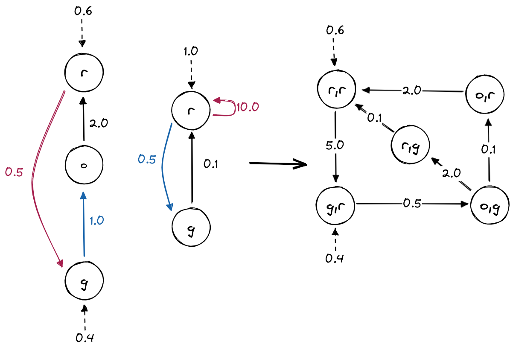

Continuous Time Markov Chain (CTMC)
===================================
In a CTMC, each transition from :math:`s` to :math:`s'` is associated to a exponential probability distribution of parameter :math:`R(s,s')`.
The probability of this transition to be triggered within :math:`\tau \in \mathbb{R}_{>0}` time-units is :math:`1 - e^{- R(s,s') \, \tau}`. 
When, from a state :math:`s`, there are more than one outgoing transition, we are in presence of a race condition.
In this case, the first transition to be triggered determines which observation is generated as well as the next state of the CTMC.
According to these dynamics, the time spent in state :math:`s` before any transition occurs, called waiting time (sometimes *dwell time*),
is exponentially distributed with parameter :math:`E(s) = \sum_{s' \in S} R(s,s')`, called exit-rate of :math:`s`.

Example
-------

In the following picture, the values on the transitions are the parameters :math:`R(s,s')`.
The observations, which are *red, yellow, blue* are represented by the color of the states.
The values on each state correspond to the expected waiting time before leaving this state:
it is the inverse of the exit-rate.

.. image:: pictures/CTMC.png
   :width: 75 %
   :align: center

Creation
^^^^^^^^

.. code-block:: python

	>>> import jajapy as ja
	>>> labelling = ['red','red','yellow','blue','blue']
	>>> transitions = [(0,1,0.08),(0,2,0.12),(1,1,0.3),(1,2,0.7),
			   (2,0,0.2),(2,3,0.1),(2,4,0.2),(3,3,0.8),
			   (3,1,0.1),(3,4,0.1),(4,2,0.25)]

	>>> model = ja.createCTMC(transitions,labelling,initial_state=0,name="My_CTMC")

We can also generate a random CTMC

.. code-block:: python

	>>> random_model = CTMC_random(number_states=5,
				       alphabet=['red','yellow','blue'],
				       random_initial_state=False,
				       min_exit_rate_time = 1.0,
				       max_exit_rate_time = 5.0)

Exploration
^^^^^^^^^^^

.. code-block:: python

	>>> model.e(0)	 
	0.2
	>>> model.expected_time(0)
	5.0
	>>> model.l(0,2)
	0.12
	>>> model.l(0,3)
	0.0
	>>> model.tau(0,2,'red')
	0.6
	>>> model.tau(0,2,'yellow')
	0.0
	>>> model.lkl(0,1.0)
	0.1637461506155964
	>>> # which is equal to 0.2*exp(-0.2*1.0), and 0.2 == model.e(0)
	>>> model.getAlphabet()
	['init','red','yellow','blue']
	>>> model.getLabel(2) 
	'yellow'

Running
^^^^^^^

.. code-block:: python

	>>> model.run(5) # returns a list of 5 observations plus the initial one without the waiting times
	['init','red', 'yellow', 'blue', 'blue', 'yellow', 'blue']
	>>> model.run(5,timed=True) # returns a list of 5 observations plus the intial one with the waiting times
	['init',0.5336343726140618,'red', 1.806338759176371, 'red', 0.05237298538963968,
	'red', 0.5556197125154162, 'red', 0.35592063754974723, 'red', 0.6101068433945884, 'red']
	>>> s = model.generateSet(10,5,timed=True) # returns a Set containing 10 traces of size 5
	>>> s.sequences
	[['init', 0.10788094099666436, 'red', 1.6789349613457798, 'red', 0.27255276944298595,
	'red', 0.42350152604909247, 'yellow', 0.20220224981867935, 'blue', 9.704572104709351, 'yellow'],
	['init', 1.6378986557150426, 'red', 4.1800880483401555, 'yellow', 1.8656306179724005,
	'red', 9.427748853607259, 'yellow', 0.21286758511326231, 'red', 2.278263556837526, 'red'],
	['init', 4.514275634368433, 'red', 1.2355021955427197, 'yellow', 0.31248093363627166,
	'red', 8.824559530285878, 'red', 0.4529508092055165, 'red', 0.07274692217838562, 'red'],
	['init', 0.04764578868145291, 'red', 0.4723999201503642, 'yellow', 0.6743349646745602,
	'red', 0.7452790320928603, 'yellow', 0.7757445460815905, 'blue', 3.1265714080061575, 'yellow'],
	['init', 0.2618927236991998, 'red', 8.945809803848748, 'yellow', 1.3509604669493112,
	'blue', 2.1740236675910465, 'yellow', 7.560013081702193, 'blue', 0.6371556825230754, 'yellow'],
	['init', 0.555526612944214, 'red', 2.1083387658424524, 'red', 1.5993222803300493,
	'yellow', 1.1866495308662353, 'blue', 0.8608021252016191, 'yellow', 1.6199990800624533, 'blue'],
	['init', 0.1643966933585648, 'red', 1.3025805686943215, 'yellow', 2.6383860396412477,
	'red', 18.014055444939096, 'red', 1.2034307567991924, 'yellow', 0.06152914313554882, 'red'],
	['init', 1.1424402840333279, 'red', 0.7250888175057543, 'red', 0.23039664620400085,
	'red', 0.8155342281890401, 'yellow', 0.06167580348263705, 'red', 3.2313274235968423, 'red'],
	['init', 1.349974406242494, 'red', 4.7893235714423605, 'yellow', 2.5583220293445823,
	'red', 3.1703454235936244, 'red', 0.98555132768311, 'yellow', 0.6707954977567278, 'blue'],
	['init', 0.6118189872487105, 'red', 7.057133997012888, 'yellow', 0.7762876536605751,
	'blue', 0.6567357090100437, 'yellow', 3.3142910438173105, 'blue', 1.397231565238264, 'blue']]
	>>> s.times # each of them appears only once
	[ 1, 1, 1, 1, 1, 1, 1, 1, 1, 1]

Analysis
^^^^^^^^

.. code-block:: python

	>>> model.logLikelihood(s) # loglikelihood of this set of traces under this model
	-12.185488019773823
	>>> # the result is quite low since it is a timed data set.

Saving/Loading
^^^^^^^^^^^^^^

.. code-block:: python

	>>> model.save("my_ctmc.txt")
	>>> the_same_model = ja.loadCTMC("my_ctmc.txt")

Converting from/to Stormpy
^^^^^^^^^^^^^^^^^^^^^^^^^^

.. code-block:: python

	>>> stormpy_sparse_model = model.toStormpy() # the next line is equivalent
	>>> stormpy_sparse_model = ja.jajapyModeltoStormpy(model)
	>>> same_model == ja.stormpyModeltoJajapy(stormpy_sparse_model) 

Converting from/to Prism
^^^^^^^^^^^^^^^^^^^^^^^^

.. code-block:: python

	>>> model.savePrism("my_ctmc.sm")
	>>> same_model = ja.loadPrism("my_ctmc.sm")

Synchronous composition
^^^^^^^^^^^^^^^^^^^^^^^
Two CTMCs can be composed to create one PCTMC.
*Jajapy* synchronous composition follows the *Prism* formalism:
it allows transitions to be labelled with actions.
These actions can be used to force two or more modules to make transitions
simultaneously (i.e. to synchronise). The rate of this transition is equal to
the product of the two individual rates.
To do so, *Jajapy* uses the ``synchronous_transitions`` attributes of the CTMC
objects.

In the following example the synchronous transitions are the coloured one, the
colour being the action.

.. code-block:: python

	>>> labelling = ['red','green','orange']
	>>> transitions = [(2,0,2.0)]
	>>> sync_trans = [(0,'ped_red',1,0.5), (1,'button',2,1.0)]
	>>>	model1 = createCTMC(transitions,labelling,[0.6,0.4,0.0],"Car_tl",sync_trans)
	>>>
	>>>labelling = ['red','green']
	>>> transitions = [(1,0,0.1)]
	>>> sync_trans = [(0,'button',1,0.5), (0,'ped_red',0,10.0)]
	>>>	model2 = createCTMC(transitions,labelling,0,"Ped_tl",sync_trans)
	>>>
	>>> composition = synchronousCompositionCTMCs(model1, model2)

Model
-----

.. autoclass:: jajapy.CTMC
   :members:
   :inherited-members:

Other Functions
---------------
.. autofunction:: jajapy.createCTMC

.. autofunction:: jajapy.loadCTMC

.. autofunction:: jajapy.CTMC_random

.. autofunction:: jajapy.synchronousCompositionCTMCs