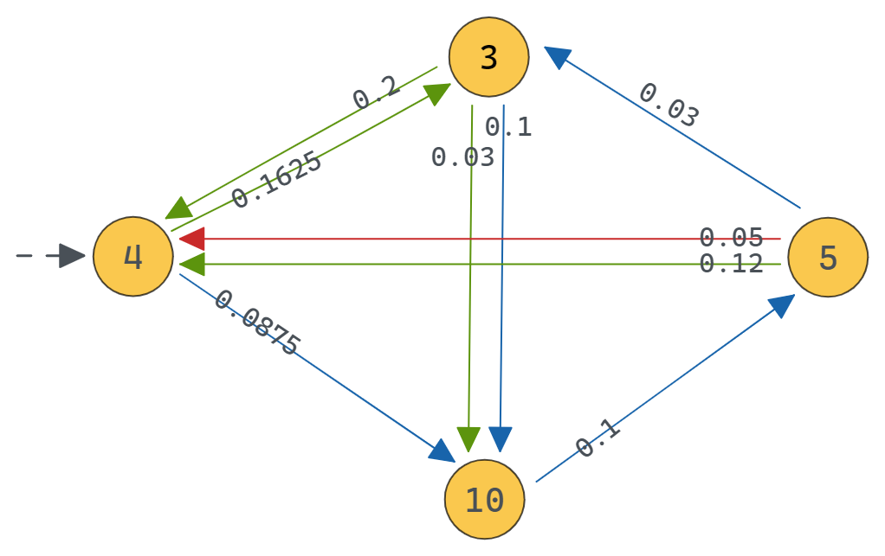

Continuous Time Markov Chain (CTMC)
===================================
In a CTMC, each transition from :math:`s` to :math:`s'` generating :math:`\ell` is associated to a exponential probability distribution of parameter :math:`R(s,\ell,s')`.
The probability of this transition to be triggered within :math:`\tau \in \mathbb{R}_{>0}` time-units is :math:`1 - e^{- R(s,\ell,s') \, \tau}`. 
When, from a state :math:`s`, there are more than one outgoing transition, we are in presence of a race condition.
In this case, the first transition to be triggered determines which observation is generated as well as the next state of the CTMC.
According to these dynamics, the time spent in state :math:`s` before any transition occurs, called waiting time, is exponentially distributed with parameter :math:`E(s) = \sum_{\ell \in L}\sum_{s' \in S} R(s,\ell,s')`, called exit-rate of :math:`s`.

Example
-------

In the following picture, the values in the states are the exit-rates. The observations, which are *red, green, blue* are represented by the color of the transitions.

Creation
^^^^^^^^

.. code-block:: python

   import jajapy as ja
   s0 = CTMC_state([[0.3/5,0.5/5,0.2/5],[1,2,3], ['r','g','r']],0)
   s1 = CTMC_state([[0.08,0.25,0.6,0.07],[0,2,2,3], ['r','r','g','b']],1)
   s2 = CTMC_state([[0.5/4,0.2/4,0.3/4],[1,3,3], ['b','g','r']],2)
   s3 = CTMC_state([[0.95/2,0.04/2,0.01/2],[0,0,2], ['r','g','r']],3)
   model = CTMC([s0,s1,s2,s3],0,name="My_CTMC")

We can also generate a random CTMC

.. code-block:: python

	>>> random_model = GOHMM_random(number_states=4,
					alphabet=['r','g','b'],
					random_initial_state=False,
					min_exit_rate_time = 1.0,
					max_exit_rate_time = 5.0,
					self_loop = False)

Exploration
^^^^^^^^^^^

.. code-block:: python

	>>> model.l(0,1,'r')		 
	0.06
	>>> model.e(0)
	0.2
	>>> model.tau(0,1,'r')
	0.3
	>>> model.observations()
	['r','g','b']
	>>> model.states[0].observations() 
	['r','g']

Running
^^^^^^^

.. code-block:: python

	>>> model.run(5) # returns a list of 5 observations without the waiting times
	['g', 'b', 'r', 'b', 'g']
	>>> model.run(5,timed=True) # returns a list of 5 observations with the waiting times
	[1.7899, 'r', 1.2648, 'b', 4.1180, 'r', 1.6083, 'r', 0.2341, 'r']
	>>> s = model.generateSet(10,5,timed=True) # returns a Set containing 10 traces of size 5
	>>> s.sequences
	[[2.3239, 'r', 1.7607, 'r', 0.2709, 'r', 10.9915, 'r',1.1925, 'r'],
	 [5.8109, 'r', 1.3057, 'g', 1.2301, 'b', 0.6581, 'r', 0.2011, 'r'],
	 [2.5906, 'g', 2.6406, 'r', 1.5017, 'r', 3.8134, 'r', 0.6904, 'g'],
	 [1.9201, 'r', 0.0616, 'r', 0.9485, 'g', 1.0669, 'r', 2.3073, 'r'],
	 [3.0573, 'g', 0.1462, 'g', 3.8546, 'r', 0.5556, 'r', 8.5845, 'r'],
	 [5.1257, 'r', 0.7490, 'g', 2.2573, 'b', 0.2812, 'g', 5.5121, 'b'],
	 [8.2343, 'g', 0.8015, 'b', 0.0581, 'r', 6.6946, 'r', 12.0532,'r'],
	 [0.1189, 'g', 8.1670, 'g', 0.4115, 'r', 2.4241, 'r', 0.5023, 'g'],
	 [10.183, 'r', 1.1402, 'r', 4.3048, 'g', 3.3382, 'g', 0.4647, 'r'],
	 [9.8944, 'g', 8.4187, 'r', 3.4253, 'r', 8.9404, 'g', 5.7353, 'r']]
	>>> s.times
	[ 1, 1, 1, 1, 1, 1, 1, 1, 1, 1]
	>>> s.type # will be 4 since this set has been generated by a CTMC
	4

Analysis
^^^^^^^^

.. code-block:: python

	>>> model.logLikelihood(s) # loglikelihood of this set of traces under this model
	-14.649420263996365

Saving/Loading
^^^^^^^^^^^^^^

.. code-block:: python

	>>> model.save("my_ctmc.txt")
	>>> another_model = ja.loadCTMC("my_ctmc.txt")

Asynchronous Composition
^^^^^^^^^^^^^^^^^^^^^^^^
We can also compose asynchronously two CTMCs as follow

.. code-block:: python

	>>> s0 = CTMC_state([[0.6/3,0.4/3],[1,1], ['r','g']],0)
	>>> s1 = CTMC_state([[0.2/4,0.7/4,0.1/4],[0,0,0], ['r','g','b']],1)
	>>> model2 = CTMC([s0,s1],0,"CTMC2")
	>>>
	>>> composition = ja.asynchronousComposition(model,model2, name="my_composition")
	>>> composition.run(5)
	['r','r','r','b','r']

If we want to keep track of which model is generating the observation in the composition
we need to set the ``disjoint`` parameter to ``True``

.. code-block:: python

	>>> disjoint_composition = ja.asynchronousComposition(model,model2, name="my_composition",disjoint=True)
	>>> disjoint_composition.run(5)
	['r2', 'g2', 'g2', 'g2', 'r2']

Model
-----

.. autoclass:: jajapy.CTMC
   :members:
   :inherited-members:

State
-----

.. autoclass:: jajapy.CTMC_state
   :members:
   :inherited-members:

Other Functions
---------------

.. autofunction:: jajapy.loadCTMC

.. autofunction:: jajapy.CTMC_random

.. autofunction:: jajapy.asynchronousComposition
