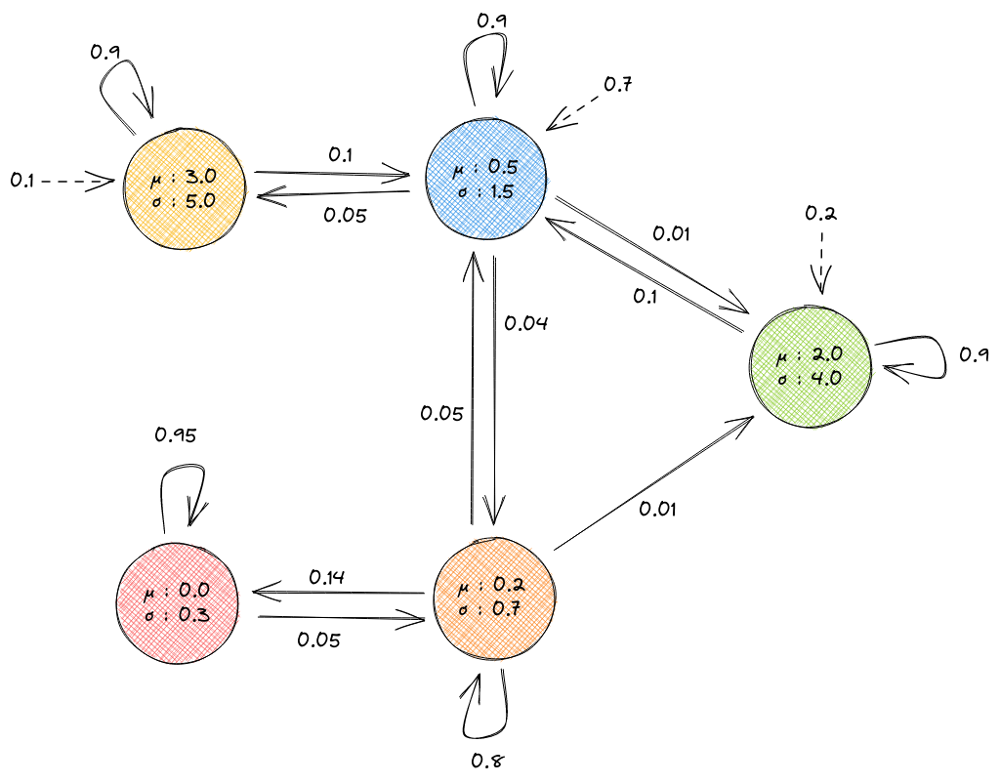

Gaussian Observations Hidden Markov Model (GOHMM)
=================================================
A GOHMM is similar to a HMM, but this time the observations are real values generated according
to gaussian distribution. Instead of having a discrete probability ditribution over all the possible
observations, each state has here the two parameters *mu* and *sigma* of a gaussian distribution.

Example
-------

In the following picture, the dotted arrows represent the initial state probability distribution: we will start
in the yellow state with probability 0.1.

Creation
^^^^^^^^
.. code-block:: python

	>>> import jajapy as ja
	>>> from numpy import array
	>>> nb_states = 5
	>>> s0 = GOHMM_state(list(zip([0,1],[0.9,0.1])),[3.0,5.0],nb_states)
	>>> s1 = GOHMM_state(list(zip([0,1,2,4],[0.05,0.9,0.04,0.01])),[0.5,1.5],nb_states)
	>>> s2 = GOHMM_state(list(zip([1,2,3,4],[0.05,0.8,0.14,0.01])),[0.2,0.7],nb_states)
	>>> s3 = GOHMM_state(list(zip([2,3],[0.05,0.95])),[0.0,0.3],nb_states)
	>>> s4 = GOHMM_state(list(zip([1,4],[0.1,0.9])),[2.0,4.0],nb_states)
	>>> matrix = array([s0[0],s1[0],s2[0],s3[0],s4[0]])
	>>> output = array([s0[1],s1[1],s2[1],s3[1],s4[1]])
	>>> model =  GOHMM(matrix,output,[0.1,0.7,0.0,0.0,0.2],"My GOHMM")
	>>> #print(model)

We can also generate a random GOHMM

.. code-block:: python

	>>> random_model = GOHMM_random(nb_states=5,
					random_initial_state=True,
					min_mu = 0.0,
					max_mu = 5.0,
					min_sigma = 0.5,
					max_sigma = 5.0)

Exploration
^^^^^^^^^^^

.. code-block:: python

	>>> model.a(0,1) 		 
	0.1
	>>> model.mu(1)
	0.5
	>>> model.b(0,4.0)
	0.07820853879509118
	>>> model.tau(0,1,4.0)
	0.00782085387950912

	
Running
^^^^^^^

.. code-block:: python

	>>> model.run(5) # returns a list of 5 observations
	[-0.6265, 0.3031, -0.5885, 5.4135, 3.45367]
	>>> s = model.generateSet(10,5) # returns a Set containing 10 traces of size 5
	>>> s.sequences
	[[-0.0069, 1.7705, -1.7140, 1.8141, -0.81803],
	 [1.9338, 12.4325, -1.0763, 1.8086, 1.4970],
	 [1.7609, 2.8232, 0.0197, -0.3019, 2.3554],
	 [0.5744, -0.9050, 0.3306, -0.3162, 2.7524],
	 [-1.4897, 1.7604, -0.2746, 0.3566, -0.3647],
	 [-3.6607, 0.9767, 0.3046, -0.3125, -0.0091],
	 [-1.6521, -0.2060, 0.0392, -0.1600, -0.5134],
	 [1.2431, 1.0243, 0.4519, -0.6647, -0.6829],
	 [-0.1490, 2.2450, 9.5885, 10.1277, 2.0458],
	 [1.8807, 0.8840, -1.2561, 2.0877, -0.5899]]

	>>> s.times
	[1, 1, 1, 1, 1, 1, 1, 1, 1, 1]
	>>> s.type #will be 2 since s has been generated by a GOHMM
	2

Analysis
^^^^^^^^

.. code-block:: python

	>>> model.logLikelihood(s) # loglikelihood of this set of traces under this model
	-10.183743400307154

Saving/Loading
^^^^^^^^^^^^^^

.. code-block:: python

	>>> model.save("my_gohmm.txt")
	>>> another_model = ja.loadGOHMM("my_gohmm.txt")

Model
-----

.. autoclass:: jajapy.GOHMM
   :members:
   :inherited-members:

State
-----

.. autoclass:: jajapy.GOHMM_state
   :members:
   :inherited-members:

Other Functions
---------------

.. autofunction:: jajapy.loadGOHMM

.. autofunction:: jajapy.GOHMM_random
