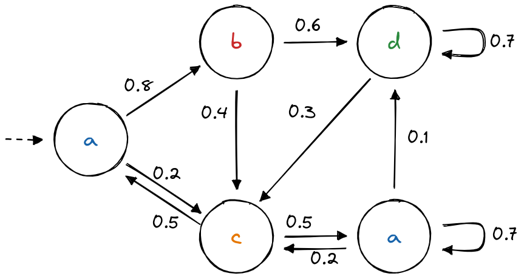

Markov Chain (MC)
=================
A MC is a deterministic model where each state is labelled with exactly one observation (called *label*).
It can be seen as a special case of HMM.
More information `here <https://en.wikipedia.org/wiki/Markov_chain>`_. 

Example
-------

Creation
^^^^^^^^
We can create the model depicted above as follow:

.. code-block:: python

	>>> import jajapy as ja
	>>> labelling=['a','b','c','d','a']
	>>> transitions = [(0,1,0.8),(0,2,0.2),
	>>> 		   (1,3,0.6),(1,2,0.4),
	>>> 		   (2,0,0.5),(2,4,0.5),
	>>> 		   (3,2,0.3),(3,3,0.7),
	>>> 		   (4,2,0.2),(4,3,0.1),(4,4,0.7)]
	>>> mc = ja.createMC(transitions, labelling, initial_state=0, name='My_MC')
	>>> print(mc)
	Name: My_MC
	Initial state: s5
	----STATE 0--a----
	s0 -> s1 : 0.8
	s0 -> s2 : 0.2

	----STATE 1--b----
	s1 -> s2 : 0.4
	s1 -> s3 : 0.6

	----STATE 2--c----
	s2 -> s0 : 0.5
	s2 -> s4 : 0.5

	----STATE 3--d----
	s3 -> s2 : 0.3
	s3 -> s3 : 0.7

	----STATE 4--a----
	s4 -> s2 : 0.2
	s4 -> s3 : 0.1
	s4 -> s4 : 0.7

	----STATE 5--init----
	s5 -> s0 : 1.0

We can also generate a random MC

.. code-block:: python

	>>> random_model = ja.MC_random(nb_states=4,
					random_initial_state=True,
					alphabet=['a','b','c'])
	>>> print(random_model)
	Name: MC_random_4_states
	Initial state: s4
	----STATE 0--a----
	s0 -> s0 : 0.32142857142857145
	s0 -> s1 : 0.07142857142857142
	s0 -> s2 : 0.35714285714285715
	s0 -> s3 : 0.25

	----STATE 1--b----
	s1 -> s0 : 0.32
	s1 -> s1 : 0.2
	s1 -> s2 : 0.24
	s1 -> s3 : 0.24

	----STATE 2--c----
	s2 -> s0 : 0.3225806451612903
	s2 -> s1 : 0.16129032258064516
	s2 -> s2 : 0.1935483870967742
	s2 -> s3 : 0.3225806451612903

	----STATE 3--a----
	s3 -> s0 : 0.2413793103448276
	s3 -> s1 : 0.3103448275862069
	s3 -> s2 : 0.3103448275862069
	s3 -> s3 : 0.13793103448275862

	----STATE 4--init----
	s4 -> s0 : 0.04
	s4 -> s1 : 0.32
	s4 -> s2 : 0.4
	s4 -> s3 : 0.24

Exploration
^^^^^^^^^^^

.. code-block:: python
	
	>>> model.getLabel(0) # label of state 0
	'a'
	>>> model.getLabel(1) # label of state 1
	'b'
	>>> model.tau(0,1,'a') # probability of moving from s0 to s1 seeing 'a' 
	0.8
	>>> model.tau(0,1,'b') # 0.0 since state 0 is not labelled with 'b'
	0.0
	>>> model.a(0,1) # same as model.tau(0,1,'a') since state 0 is labelled with 'a'
	0.8
	>>> model.getAlphabet()	 # all possible observations
	['init','a','b','c','d']

Running
^^^^^^^

.. code-block:: python

	>>> model.run(5) # returns a list of 5 observations
	['init','a', 'b', 'd', 'd', 'c']
	>>> s = model.generateSet(10,5) # returns a Set containing 10 traces of size 5
	>>> s.sequences
	[['init','a', 'b', 'd', 'd', 'd'], ['init','a', 'b', 'c', 'a', 'b'],
	['init','a', 'b', 'd', 'c', 'a'], ['init','a', 'b', 'd', 'd', 'c']]
	>>> s.times # the first sequence appears four times, the second twice, etc...
	[4, 2, 3, 1]

Analysis
^^^^^^^^

.. code-block:: python

	>>> model.logLikelihood(s) # loglikelihood of this set of traces under this model
	-1.8009169143518982

Saving/Loading
^^^^^^^^^^^^^^

.. code-block:: python

	>>> model.save("my_mc.txt")
	>>> same_model = ja.loadMC("my_mc.txt")

Converting from/to Stormpy
^^^^^^^^^^^^^^^^^^^^^^^^^^

.. code-block:: python

	>>> stormpy_sparse_model = model.toStormpy() # the next line is equivalent
	>>> stormpy_sparse_model = ja.jajapyModeltoStormpy(model)
	>>> same_model == ja.stormpyModeltoJajapy(stormpy_sparse_model) 

Converting from/to Prism
^^^^^^^^^^^^^^^^^^^^^^^^

.. code-block:: python

	>>> model.savePrism("my_mc.sm")
	>>> same_model = ja.loadPrism("my_mc.sm")

Model
-----

.. autoclass:: jajapy.MC
   :members:
   :inherited-members:

Other Functions
---------------
.. autofunction:: jajapy.createMC

.. autofunction:: jajapy.loadMC

.. autofunction:: jajapy.MC_random