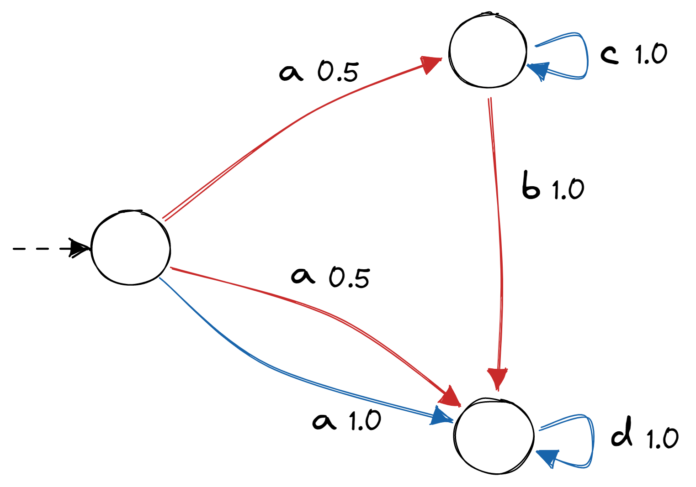

Markov Decision Process (MDP)
=============================
A MDP is similar to a MC, but with non-determinism. More information `here <https://en.wikipedia.org/wiki/Markov_decision_process>`_.

Example:
In the following picture the actions are represented by the colors. Hence, by executing action *blue* in the leftern state, we will, 
with probability one, observe *a* and reach the bottom state.

.. code-block:: python

   import jajapy as ja
   s0 = ja.MDP_state({'red': [[0.5,0.5],[1,2],['a','a']], 'blue': [[1.0],[2],['a']]}, 0)
   s1 = ja.MDP_state({'red': [[1.0],[2],['b']], 'blue': [[1.0],[1],['c']]}, 0)
   s2 = ja.MDP_state({'blue': [[1.0],[2],['d']]}, 0)
   lst_states = [s0, s1, s2]
   model = ja.MDP(states=lst_states,initial_state=0,name="My MDP")

Model
-----

.. autoclass:: jajapy.MDP
   :members:
   :inherited-members:

State
-----

.. autoclass:: jajapy.MDP_state
   :members:
   :inherited-members:

Other Functions
---------------

.. autofunction:: jajapy.loadMDP

.. autofunction:: jajapy.MDP_random

.. autofunction:: jajapy.KLDivergence

.. autofunction:: jajapy.MDPFileToPrism

.. autofunction:: jajapy.loadPrismMDP

Scheduler
---------

.. autoclass:: jajapy.UniformScheduler
   :members:
   :inherited-members:

.. autoclass:: jajapy.MemorylessScheduler
   :members:
   :inherited-members:

.. autoclass:: jajapy.FiniteMemoryScheduler
   :members:
   :inherited-members: