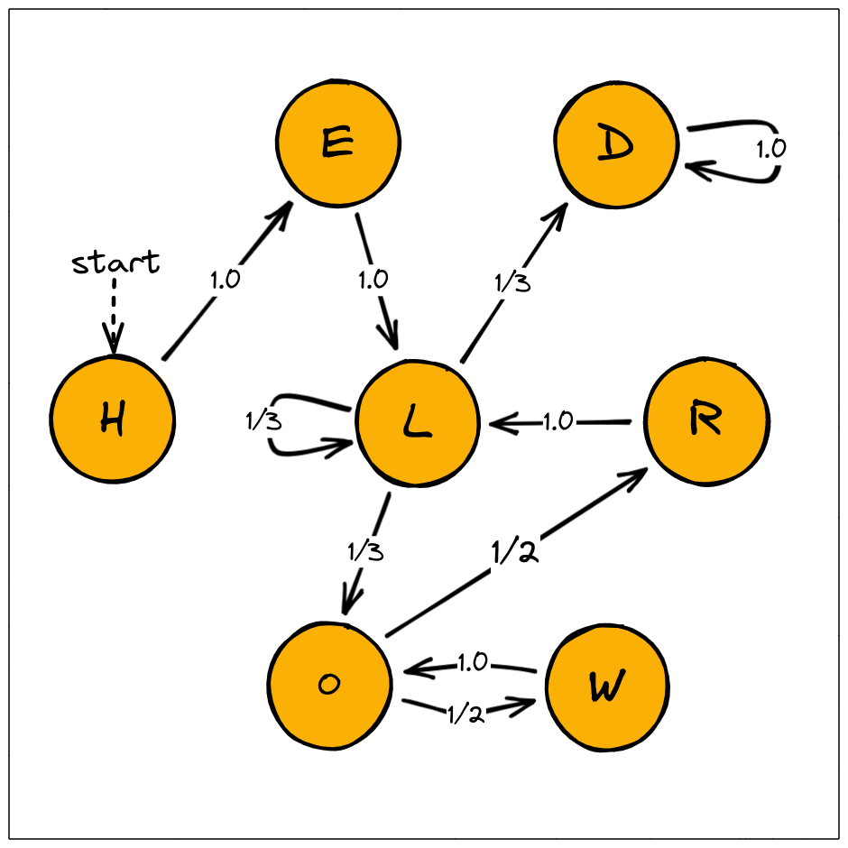

.. _example-helloworld :

1. A simple example with MC: Hello World
=========================================

:download:`python file <https://github.com/Rapfff/jajapy/tree/main/examples/01-helloworld.py>`

In this example, we will:

1. Create an MC *H* from scratch,
2. Use it to generate a training set,
3. Use the Baum-Welch algorithm to learn, from the training set, *H*,
4. Compare *H* with the model generated at the previous step.

Creating an MC
^^^^^^^^^^^^^^

.. _create-hmm-example:

We can create the model depicted above like this:

.. code-block:: python

	>>> import jajapy as ja
	>>> labelling = list('HELOWRD')
	>>> initial_state = 0 # we always start in state 0.
	>>> name = "MC_Helloworld"
	>>> # From state 0 we move to state 1 with probability 1.0,
	>>> # from state 2 we move to state 3 with probability 1/3, etc...
	>>> transitions = [(0,1,1.0),(1,2,1.0),(2,2,1/3),(2,3,1/3),(2,6,1/3),
	>>> 			   (3,4,0.5),(3,5,0.5),(4,3,1.0),(5,6,1.0),(6,6,1.0)]
	>>> original_model = ja.createMC(transitions,labelling,initial_state,name)
	>>> #print(original_model)

*(optional)* This model can be saved into a text file and then loaded as follow:

.. code-block:: python

	>>> original_model.save("my_model.txt")
	>>> original_model = ja.loadMC("my_model.txt")

Generating a training set
^^^^^^^^^^^^^^^^^^^^^^^^^
Now we can generate a training set. This training set contains 1000 traces, which all consists of 10 observations.

.. code-block:: python

	# We generate 1000 sequences of 10 observations
	>>> training_set = original_model.generateSet(1000,10)

*(optional)* This Set can be saved into a text file and then loaded as follow:

.. code-block:: python

	>>> training_set.save("my_training_set.txt")
	>>> training_set = ja.loadSet("my_training_set.txt")

Learning an MC using BW
^^^^^^^^^^^^^^^^^^^^^^^
Let now use our training set to learn ``original_model`` with the Baum-Welch algorithm:

.. code-block:: python

	>>> # We want our output model to have 7 states, as the original one
	>>> output_model = ja.BW().fit(training_set,nb_states=7)
	|████████████████████████████████████████| (!) 10 in 0.4s (23.14/s) 

	---------------------------------------------
	Learning finished
	Iterations:	   10
	Running time:  0.470376
	---------------------------------------------

	>>> #print(output_model)

For the initial model we used a randomly generated MC with 7 states.
The states label will be decided regarding to the training set:
*Jajapy* first extract the *alphabet* (the set of all the possible labels) from the training_set,
then it associates each label to one states. If there are more states than labels the remaining
states will be labeled uniformly at random. If there are less states than labels the learning will
be impossible.

Evaluating the BW output model using model checking
^^^^^^^^^^^^^^^^^^^^^^^^^^^^^^^^^^^^^^^^^^^^^^^^^^^
Eventually we compare the output model with the original one.
We can do so by comparing the value of some properties under this two models as follows:

.. code-block:: python

	>>> import stormpy
	>>> # We first convert the original model to a Stormpy one,
	>>> # to compare the model checking results.
	>>> # the output model is already a Stormpy model.
	>>> original_model = ja.jajapyModeltoStormpy(original_model)
	>>> # Now we can model check the two models, using Stormpy.

Let's first compare the probability that each model generates *"HELLO"*.

.. code-block:: python

	>>> formula_str = 'P=? [ (((("init" U "H") U "E") U "L") U=5 "O")]'
	>>> properties = stormpy.parse_properties(formula_str)
	>>> result_original = stormpy.check_model_sparse(original_model,properties[0])
	>>> result_output   = stormpy.check_model_sparse(output_model,properties[0])
	>>> 
	>>> # Probability that the original model generates HELLO:
	>>> print(result_original.at(original_model.initial_states[0]))
	0.1111111111111111
	>>> # Probability that the output model generates HELLO:
	>>> print(result_output.at(output_model.initial_states[0]))
	0.11223809250215452

We may notice that, in fact, we are comparing the proabilities that they generate *"initHELLO"*.
This is due to the fact that, in Stormpy, the intial state is labeled by *"init"*. See :ref:`jajapy-and-stormpy`

.. code-block:: python

	>>> formula_str = 'P=? [ F<=10 "D" ]'
	>>> 
	>>> properties = stormpy.parse_properties(formula_str)
	>>> result_original = stormpy.check_model_sparse(original_model,properties[0])
	>>> result_output   = stormpy.check_model_sparse(output_model,properties[0])
	>>> 
	>>> # Model checking result for "+formula_str+' in the original model:
	>>> print(result_original.at(original_model.initial_states[0]))
	0.9107796067672609
	>>> # Model checking result for "+formula_str+' in the output model:
	>>> print(result_output.at(output_model.initial_states[0]))
	0.9004150713470688

