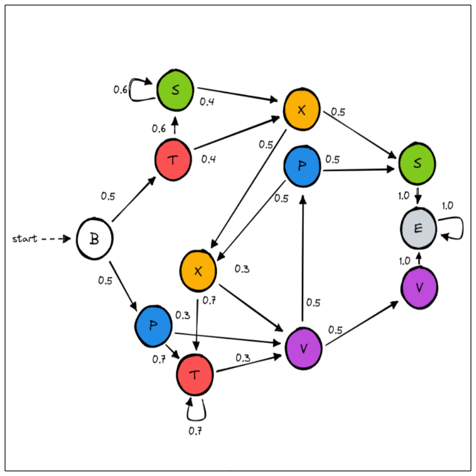

.. _example-random_restart :

2. Learning an MC with random restart
=====================================

:download:`python file <https://github.com/Rapfff/jajapy/tree/main/examples/02-random_restart.py>`

This time we will try to learn the `Reber grammar <https://cnl.salk.edu/~schraudo/teach/NNcourse/reber.html>`_.
We have added probabilities on the transitions in order to have an MC.

The Baum-Welch algorithm is sensitive to the initial hypothesis choice: the ouptput model depends on the initial hypothesis.
To improve the quality of our output model, we will run the algorithm several times and keep only the best model, i.e. the
one maximizing the loglikelihood of a test set. This technique is called *random restart*.

Creating the original MC and generating the training set
^^^^^^^^^^^^^^^^^^^^^^^^^^^^^^^^^^^^^^^^^^^^^^^^^^^^^^^^
This step is similar to the first steps in :ref:`example-helloworld`.

.. code-block:: python
	
	>>> import jajapy as ja
	>>> # State 0 is labelled with B, state 1 with T, etc...
	>>> labelling = list("BTSXSPTXPVVE")
	>>> initial_state = 0
	>>> name = "MC_REBER"
	>>> # From state 0 we move to state 1 with probability 0.5
	>>> # and to state 5 with probability 0.5, and so on...
	>>> transitions = [(0,1,0.5),(0,5,0.5),(1,2,0.6),(1,3,0.4),(2,2,0.6),(2,3,0.4),
	>>> 			   (3,7,0.5),(3,4,0.5),(4,11,1.0),(5,6,0.7),(5,9,0.3),
	>>> 			   (6,6,0.7),(6,9,0.3),(7,6,0.7),(7,9,0.3),(8,7,0.5),(8,4,0.5),
	>>> 			   (9,8,0.5),(9,10,0.5),(10,11,1.0),(11,11,1.0)]
	>>> original_model = ja.createMC(transitions,labelling,initial_state,name)
	>>> 
	>>> # We generate 1000 sequences of 10 observations for each set
	>>> training_set = original_model.generateSet(1000,10)
	>>> test_set = original_model.generateSet(1000,10)

Learning the MC using random restart
^^^^^^^^^^^^^^^^^^^^^^^^^^^^^^^^^^^^
We will learn the model 10 times and keep only the best one (according to the test set loglikelihood).

.. code-block:: python

	>>> nb_trials = 10

At each iteration, the library will generate a new model with 12 states.
Since the alphabet contains 7 labels *(B, P, X, T, V, E)*, the 7 first states will
be labeled by the 7 labels, and the 5 remaining states will be labelled uniformly at random.
*Jajapy* warns us every time.

.. code-block:: python

	>>> best_model = None
	>>> quality_best = -1024
	>>> for n in range(1,nb_trials+1):
	...		current_model = ja.BW().fit(training_set,nb_states=12,pp=n, stormpy_output=False)
	...		current_quality = current_model.logLikelihood(test_set)
	...		if quality_best < current_quality: #we keep the best model only
	...			quality_best = current_quality
	...			best_model = current_model

	WARNING: the size of the labelling is lower than the number of states. The labels for the last states will be chosen randomly.
	1 |████████████████████████████████████████| (!) 70 in 6.0s (11.76/s) 

	---------------------------------------------
	Learning finished
	Iterations:	   70
	Running time:  5.988786
	---------------------------------------------

	WARNING: the size of the labelling is lower than the number of states. The labels for the last states will be chosen randomly.
	2 |████████████████████████████████████████| (!) 15 in 1.3s (11.19/s) 

	---------------------------------------------
	Learning finished
	Iterations:	   15
	Running time:  1.342325
	---------------------------------------------
	[...]
	WARNING: the size of the labelling is lower than the number of states. The labels for the last states will be chosen randomly.
	10 |████████████████████████████████████████| (!) 43 in 3.7s (11.71/s) 

	---------------------------------------------
	Learning finished
	Iterations:	   43
	Running time:  3.674569
	---------------------------------------------

For readability reasons we removed the prints for the 3rd to 9th iteration.
Notice that the current trial number appears at the beginnig of each print: this is because we 
have set the ``pp`` parameter of the ``fit`` method with the current trial number.

.. code-block:: python

	>>> print(quality_best)
	-4.688696535740125

The loglikelihood of the test set under the best model is good. Let's have a look to the model:

.. code-block:: python

	>>> print(best_model)
	Name: unknown_MC
	Initial state: s12
	----STATE 0--B----
	s0 -> s1 : 0.496
	s0 -> s7 : 0.504

	----STATE 1--P----
	s1 -> s2 : 0.18033
	s1 -> s4 : 0.6996
	s1 -> s11 : 0.12007

	----STATE 2--V----
	s2 -> s8 : 0.63378
	s2 -> s10 : 0.36622

	----STATE 3--E----
	s3 -> s3 : 1.0

	----STATE 4--T----
	s4 -> s2 : 0.22868
	s4 -> s4 : 0.69386
	s4 -> s11 : 0.07746

	----STATE 5--S----
	s5 -> s3 : 1.0

	----STATE 6--X----
	s6 -> s2 : 0.09906
	s6 -> s4 : 0.30695
	s6 -> s5 : 0.31655
	s6 -> s6 : 0.27338
	s6 -> s11 : 0.00406

	----STATE 7--T----
	s7 -> s6 : 0.40675
	s7 -> s9 : 0.59325

	----STATE 8--V----
	s8 -> s3 : 1.0

	----STATE 9--S----
	s9 -> s6 : 0.39242
	s9 -> s9 : 0.60758

	----STATE 10--P----
	s10 -> s5 : 0.49455
	s10 -> s6 : 0.50545

	----STATE 11--V----
	s11 -> s8 : 0.3022
	s11 -> s10 : 0.6978

	----STATE 12--init----
	s12 -> s0 : 1.0
