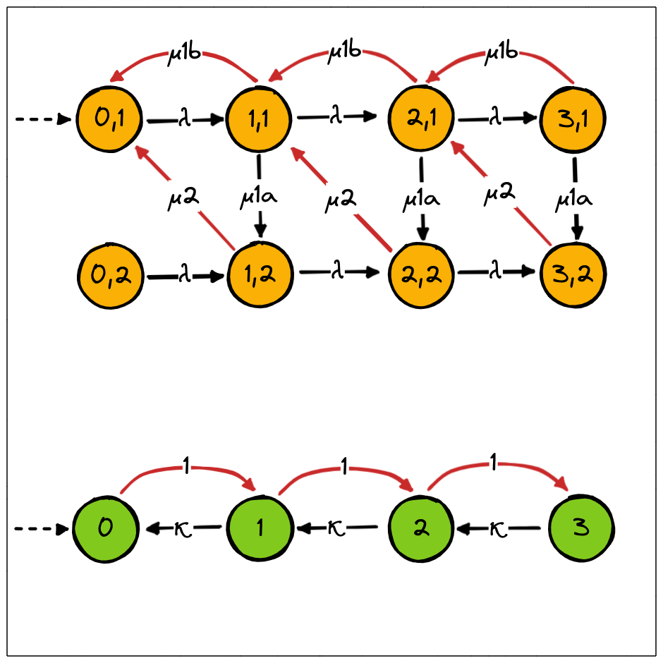

.. _example-pctmc :

6. Parameter estimation for PCTMCs
==================================

:download:`python file <https://github.com/Rapfff/jajapy/tree/main/examples/06-pctmc.py>`
:download:`prism model <https://github.com/Rapfff/jajapy/tree/main/examples/materials/tandem_3.sm>`

Here, we have access to a Prism file describing a composition of two CTMCs, where
the value of certain parameters is unknown, and a training set.
We will show how, from this training set , we can use *Jajapy* to estimate the parameter values.

The Tandem queueing network
^^^^^^^^^^^^^^^^^^^^^^^^^^^

The model above represents the `tandem queueing network <http://www.prismmodelchecker.org/casestudies/tandem.php>`_
where *c=3*. The yellow model corresponds to the *serverC*, and the green one the *SeverM*.
For each yellow state, the first value corresponds to the value of *sc* and the second one the value of *phi*.
The red transitions are the synchronous transitions (the *route* transitions in the Prism file), while the black
transitions are the asynchronous one.

In this example, we assume that we know the value of *c* and :math:`\lambda`, and that the *serverC* is fully observable
(i.e. we know, at any time, in which state is the *serverC*). However, we don't know the value of :math:`\kappa, \mu_{1a},`
:math:`\mu_{1b}` and :math:`\mu_2`, either the current state of *serverM*.

We can generate the training set by loading the model, instantiating the parameters with their real values, and
using the ``generateSet`` method:

.. code-block:: python

	import jajapy as ja
	>>> m = ja.loadPrism("tandem_3.sm")
	>>> m.instantiate(["mu1a","mu1b","mu2","kappa"],[0.2,1.8,2.0,4.0])
	>>> training_set = m.generateSet(100,30,timed=True)

You may notice that there is no label for the *sm* in the Prism file, hence, while generating the training set,
there will be no information about the current state of *serverM*.

Parameter estimation
^^^^^^^^^^^^^^^^^^^^
Now, let estimate the parameters value from the training set.
First, we need our intial hypothesis: it is the same model with the parameters left non-instantiated.
The learning method will start by instantiate the non-instantiated parameters by a random value
between ``min_val`` and ``max_val``.

.. code-block:: python
	
	>>> intial_hypothesis = loadPrism("tandem_3.sm")
	>>> parameter_values = ja.BW().fit_nonInstantiatedParameters(training_set,
													intial_hypothesis,
													min_val=0.1, max_val=5.0)
	Fitting only parameters: mu1a, mu1b, mu2, kappa
	Removing unused states: from 29 states to 29
	|████████████████████████████████████████| (!) 3 in 6.4s (0.47/s) 

	---------------------------------------------
	Learning finished
	Iterations:	   3
	Running time:	   6.394461
	---------------------------------------------
	
	>>> type(parameter_values)
	dict

This methods returns a dictionary with the parameter names as keys.

.. code-block:: python

	>>> for parameter in output_val.keys():
			print("parameter",parameter,':')
			print("Estimated value:", output_val[parameter],end='')
			print(", real value:",original_model.parameterValue(parameter))
			print()
	parameter mu1a :
	Estimated value: 0.202, real value: 0.2

	parameter mu1b :
	Estimated value: 1.86, real value: 1.8

	parameter mu2 :
	Estimated value: 1.938, real value: 2.0

	parameter kappa :
	Estimated value: 4.169, real value: 4.0
