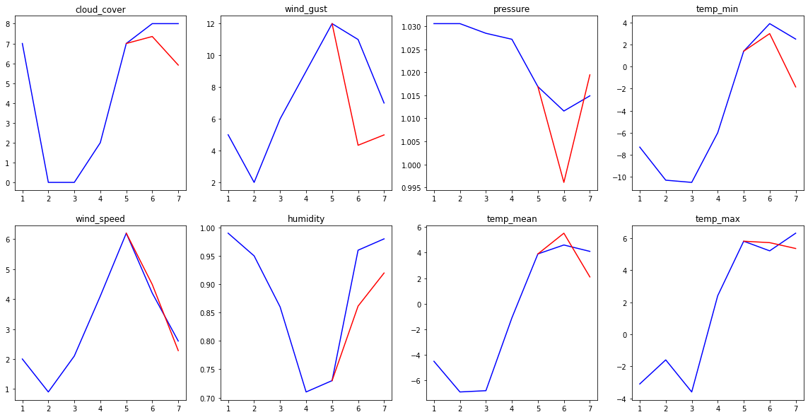
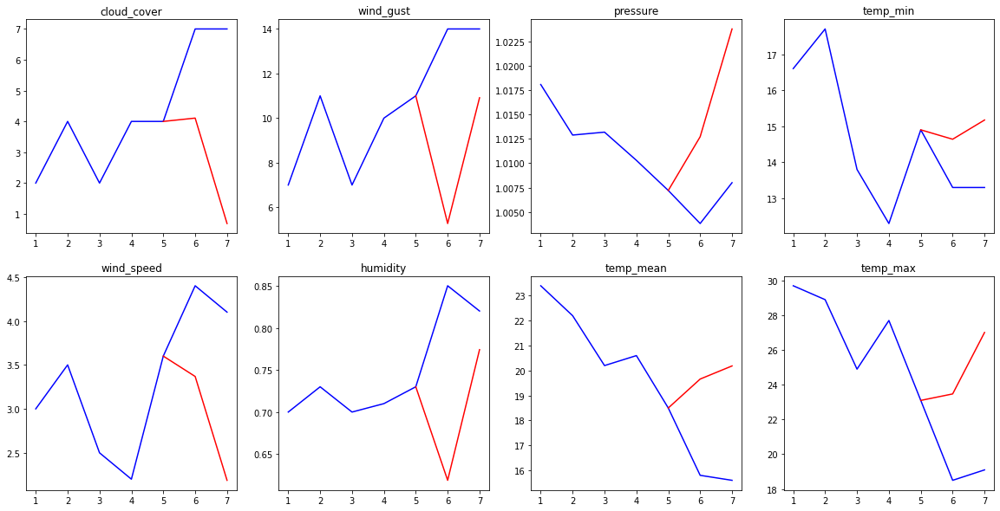
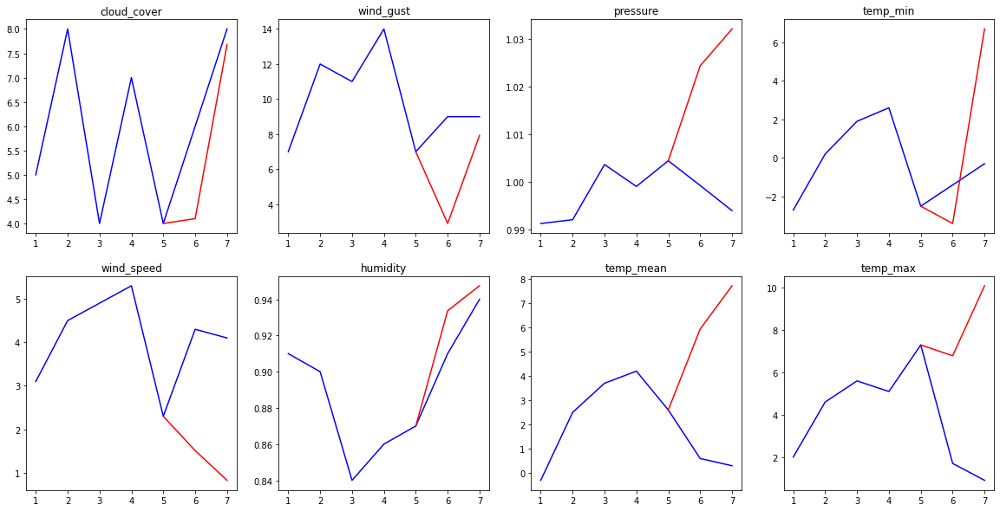

.. _example-gohmm :

8. Learning a GoHMM from a csv
==============================
The dataset is from:

.. image:: https://zenodo.org/badge/DOI/10.5281/zenodo.7525955.svg
   :target: https://doi.org/10.5281/zenodo.7525955

This example is based on `this kaggle notebook <https://www.kaggle.com/code/rapfff/weather-prediction-using-hmm>`_.

Introduction
^^^^^^^^^^^^
In this example, we will create a GoHMM for weather forecasting.

Shortly, GoHMMs are HMMs where all states contains several gaussian distribution (instead of a distribution over the labels/observations).
Hence, each time the GoHMM is in a state, it generates *n* real number (with *n* the number of gaussian distributions in the state).

Here, the *n* gaussian distributions present in each state will correspond to *n* different weather features (cloud cover, minimal temperature, humidity, etc...).

Building the training set and test set
^^^^^^^^^^^^^^^^^^^^^^^^^^^^^^^^^^^^^^
Our dataset contains weather observations from 2000 to 2009 included for several european cities.
We will use 2000-2008 included as a training set, and 2009 as a test set.
To do it, we build a function that keep only the columns we are interested in, and group the data into sequences of length `len_seq`.

.. code-block:: python

	>>>def training_test_set(cols: list, len_seq: int):
	>>>		"""
	>>>		`cols` are the columns we want to keep
	>>>		`len_seq` indicates how many days are included in one sequence in the training/test set.
	>>>		For instance, if `len_seq` is equal to 7, our training set and test set will contains
	>>>		sequences of seven days observations.
	>>>		"""
	>>>		arr = loadtxt("weather_prediction_dataset.csv",delimiter=',',dtype=str)
	>>>		nb_distributions = len(cols)
	>>>		arr = arr[:,cols]
	>>>		print(arr[0])
	>>>		training_set = array(arr[1:3289],dtype=float64) # 2000-2008
	>>>		test_set = array(arr[3289:],dtype=float64) # 2009
	>>>		#
	>>>		complete_seq = len(training_set)//len_seq
	>>>		#drop = training_set[len(training_set)-len(training_set)%len_seq:]
	>>>		training_set = training_set[:len(training_set)-len(training_set)%len_seq]
	>>>		training_set = training_set.reshape((complete_seq,len_seq,nb_distributions))
	>>>		training_set = ja.Set(training_set,ones(len(training_set)),t=3) #t=3 because this is a Set for a GOHMM, see Jajapy doc
	>>>		#
	>>>		complete_seq = len(test_set)//len_seq
	>>>		#drop = test_set[len(test_set)-len(test_set)%len_seq:]
	>>>		test_set = test_set[:len(test_set)-len(test_set)%len_seq]
	>>>		test_set = test_set.reshape((complete_seq,len_seq,nb_distributions))
	>>>		test_set = ja.Set(test_set,ones(len(test_set)),t=3)#t=3 because this is a Set for a GOHMM, see Jajapy doc
	>>>		#
	>>>		return training_set, test_set

We first need to decide which columns we keep.

1. We want to train our model for De Bilt only,
2. looking at the data, some columns don't seem to be normally distributed. Since our model is a Gaussian model, it will have trouble to estimate these parameters. We will then get rid of them. In practice, we will keep all the columns for De Bilt, except global radiation, sunshine and precipitation.

Finally, we want to train our model on sequences of one week. We will then set `len_seq` to 7.

.. code-block:: python

	>>> training_set, test_set = training_test_set([19,20,21,22,23,27,28,29],7)
	['DE_BILT_cloud_cover' 'DE_BILT_wind_speed' 'DE_BILT_wind_gust'
	'DE_BILT_humidity' 'DE_BILT_pressure' 'DE_BILT_temp_mean'
	'DE_BILT_temp_min' 'DE_BILT_temp_max']

Let's take a look to our training set. It contains 7x8 matrices:

* 7 because of the seven days of a week,
* 8 because of the eight parameters we are interested in, namely cloud cover, wind speed, wind gust, humidity, pressure, mean temperature, minimal temperature, and maximal temperature.

.. code-block:: python

	>>> print("Dimension of our training set:",training_set.sequences.shape)
	Dimension of our training set: (469, 7, 8)
	>>> print("First sequence in the training set:\n",training_set.sequences[0])
	First sequence in the training set:
	[[ 7.      2.5     8.      0.97    1.024   6.1     3.5     8.1   ]
	[ 8.      3.7     9.      0.97    1.0267  7.3     5.4     8.7   ]
	[ 8.      6.1    13.      0.94    1.0203  8.4     6.4     9.6   ]
	[ 7.      3.8    15.      0.94    1.0142  6.4     4.3     9.4   ]
	[ 3.      4.     12.      0.9     1.0183  4.4     1.4     7.4   ]
	[ 6.      5.2    11.      0.91    1.0152  7.2     4.2     9.1   ]
	[ 7.      4.8    12.      0.92    1.0199  6.1     4.3     7.4   ]]

The test set is similar, but has only 52 sequences, for the 52 weeks of the last year (2009):

.. code-block:: python

	>>> print("Dimension of our test set:",test_set.sequences.shape)
	Dimension of our test set: (52, 7, 8)

Creating the initial hypothesis
^^^^^^^^^^^^^^^^^^^^^^^^^^^^^^^
Before training our model we first need to initialize it.
For that, we will simply use Jajapy to generate a random model.
We set the parameters according to our experience and knowledge.

.. code-block:: python

	>>> import jajapy as ja
	>>> initial_hypothesis = ja.GoHMM_random(nb_states=15, # this is arbitrary
	>>> 					nb_distributions=8, # since we have eights parameters to estimate
	>>> 					random_initial_state=True, # our model can start in any state
	>>> 					min_mu=-5.0, # minimum value for the mu parameters of the distributions
	>>> 					max_mu=5.0, # maximum value for the mu parameters of the distributions
	>>> 					min_sigma=1.0,# same for the sigma parameters. MUST BE STRICLTY POSITIVE!
	>>> 					max_sigma=5.0)# same for the sigma parameters. MUST BE STRICLTY POSITIVE!

Training the model
^^^^^^^^^^^^^^^^^^
We can now train our model using the Baum-Welch algorithm, adapted to GoHMMs.

.. code-block:: python
	
	>>> output_model = ja.BW().fit(training_set,initial_hypothesis)
	Learning a GoHMM...
	|████████████████████████████████████████| (!) 313 in 19:07.1 (0.27/s) 

	---------------------------------------------
	Learning finished
	Iterations:	   313
	Running time:	   1147.123998
	---------------------------------------------

Results
^^^^^^^

Let's see our weather forecasting model in action.
To do so, we will give to our model the first 5 days of a week, and we will ask him to forecast the weather for the next 2 days.
How? By computing, for each state :math:`s`, the probability to be in this state after the 5 first days (we denote it by :math:`p_s`).
Then, we use our model to generate a sequence of length 2 (for the last 2 days) for the state maximizing :math:`p_s`, formally from
:math:`\text{argmax}_s p_s`.

.. code-block:: python
	
	>>> def testing(m: ja.GoHMM, seq: list, steps=5):
	>>>		"""
	>>>		m is our model
	>>>		seq is one trace, i.e. one sequences of observations
	>>>		steps corresponds to the number of steps we give to our model, the last
	>>>		len(seq)-steps will be forecasted by our model.
	>>>		"""
	>>>		alphas = m._initAlphaMatrix(steps)
	>>>		alphas = m._updateAlphaMatrix(seq[:steps],0,alphas) # computing the probabilities p_s
	>>>		alphas = alphas[-1] # keeping only the praobability after the last day
	>>>		current = argmax(alphas) # keeping only the best state
	>>>		#
	>>>		forecast = m.run(len(seq)-steps,current)
	>>>		reality  = seq[steps:]
	>>>		#
	>>>		#PLOT
	>>>		fig, axs = plt.subplots(2,4)
	>>>		#
	>>>		features = ["cloud_cover","wind_speed","wind_gust","humidity","pressure","temp_mean","temp_min","temp_max"]
	>>>		#
	>>>		for i in range(m.nb_distributions):
	>>>			axs[i%2][i//2].plot(range(1,len(seq)+1),[seq[j][i] for j in range(len(seq))], c='b')
	>>>			axs[i%2][i//2].plot(range(steps,len(seq)+1),[seq[steps-1][i]]+[forecast[j][i] for j in range(len(forecast))], c='r')
	>>>			axs[i%2][i//2].set_title(features[i])
	>>>		#
	>>>		plt.show()

.. code-block:: python

	>>> testing(output_model, test_set.sequences[1],steps=5)

.. code-block:: python

	>>> testing(output_model, test_set.sequences[26],steps=5)

.. code-block:: python

	>>> testing(output_model, test_set.sequences[51],steps=5)

