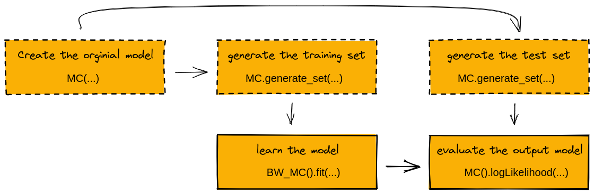

Getting Started
===============

1. Installation
---------------

To install jajapy just run the following command:

.. code-block:: python

	>>> pip install jajapy

2. Models
---------

`jajapy` supports different kind of Markov models that have different properties.

The following table summarizes the main properties of these models. The *first column* indicates
if, at each timestep, a model generates a discrete observation, a continuous observations, or a
vector of continuous observations. The *second column* indicates if the model is deterministic or not.
And finally the *third column* shows if the model is a continuous time model (or a discrete time model).
A continuous time model will wait in each state for some period of time before moving to another state.

======  ==================== ============= ===============
Model   Observations type    Deterministic Continuous time
======  ==================== ============= ===============
HMM                 Discrete           Yes              No
MC                  Discrete           Yes              No
MDP                 Discrete            No              No
CTMC                Discrete           Yes             Yes
GOHMM             Continuous           Yes              No
MGOHMM  Vector of Continuous           Yes              No
======  ==================== ============= ===============

One can wander what is the difference between MC and HMM: each MC state is labelled with exactly one
observation, which is seen each time we are in this state. On the other hand, each HMM state is
associated with a probability distribution over the observations. Each time we are in this HMM state,
an observation is generated according to the probability distribution associated to this state.

.. toctree::
   :maxdepth: 1

   HMM
   MC
   MDP
   CTMC
   GOHMM
   MGOHMM

Technical information
^^^^^^^^^^^^^^^^^^^^^

In *jajapy* we use explicit representation for the models. Hence, each model has a *numpy ndarray* as attribute which
describes all the transitions in the model.

The following tables recaps how the models and the ndarrays are structured:

========== ================ ====================== ============ ================= =================
HMM                   Usage         Type of output Source state Destination State       Observation
========== ================ ====================== ============ ================= =================
HMM.matrix   matrix[s1][s2]    Probability (float)           s1                s2
HMM.output  output[s1][obs]    Probability (float)           s1                s2 HMM.alphabet[obs]
========== ================ ====================== ============ ================= =================

========== =============== ====================== ============ ================= ================
MC                   Usage         Type of output Source state Destination State      Observation
========== =============== ====================== ============ ================= ================
MC.matrix   matrix[s1][s2]    Probability (float)           s1                s2  MC.labeling[s1]
========== =============== ====================== ============ ================= ================

========== ===================== ====================== ============ ================= ================ ================
MDP                        Usage         Type of output Source state Destination State      Observation           Action
========== ===================== ====================== ============ ================= ================ ================
MDP.matrix   matrix[s1][act][s2]    Probability (float)           s1                s2 MDP.labeling[s1] MDP.actions[act]
========== ===================== ====================== ============ ================= ================ ================

============ =============== ============== ============ ================= ==================
CTMC                   Usage Type of output Source state Destination State        Observation
============ =============== ============== ============ ================= ==================
CTMC.matrix   matrix[s1][s2]   Rate (float)           s1                s2 CTMC.labeling[s1]
============ =============== ============== ============ ================= ==================

============ ================ ===================================== ============= =================
GOHMM                   Usage                        Type of output  Source state Destination State
============ ================ ===================================== ============= =================
GOHMM.matrix   matrix[s1][s2]                   Probability (float)            s1                s2
GOHMM.output       output[s1] List of parameters [mu, sigma] (list)            s1                  
============ ================ ===================================== ============= =================

============= ================ ============================================= ============ =================
MGOHMM                   Usage                                Type of output Source state Destination State
============= ================ ============================================= ============ =================
MGOHMM.matrix   matrix[s1][s2]                           Probability (float)           s1                s2
MGOHMM.output       output[s1] List of List of parameters [mu, sigma] (list)           s1                  
============= ================ ============================================= ============ =================

3. Workflow
-----------

A complete workflow. In green: algorithms provided by Jajapy. In blue: algorithms provided by Stormpy.

To learn a model with jajapy, we need to have a training set. And to evaluate it, we need a test set. In a real life application,
these sets are given, but one can imagine a situation where we have access to the original model instead.
In such case, we first need to generate the sets before using them.

Once a model is learnt, it is directly translated to a *stormpy sparse model* by default (if stormpy is installed on the machine).
You can change this behaviour by changing the value of the parameter `stormpy_output` of the `fit` function.

4. From Jajapy to stormpy and vice versa 
----------------------------------------

Due to performance reasons, Jajapy uses its representation of the models during the learning process.
Once the learning process is over, Jajapy converts the output model to a sparse Stormpy model.

The initial hypothesis of the Baum-Welch algorithm can be provided as a jajapy model or a sparse stormpy model.
If a stormpy model is provided, jajapy will first translate it.

These translation are straightforward and doesn't change the structures of the models.

.. note::
   Stormpy sparseCtmc and spraseMdp can be translated to Jajapy model only if all of the state in the sparse model
   are labelled with at most one observation (without counting the *init* one).

5. Examples
-----------

You can find examples in the tutorial page.