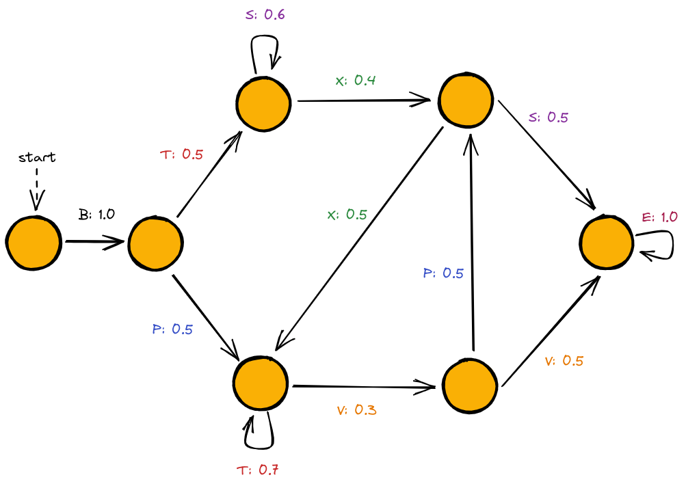

Getting Started
===============

A simple example with HMMs
--------------------------

In this example, we will:

1. Create a HMM *H* from scratch,
2. Use it to generate a training set,
3. Use the Baum-Welch algorithm to learn, from the training set, *H*,
4. Compare *H* with the model generated at the previous step.

Creating a HMM
^^^^^^^^^^^^^^

We can create the model depicted above like this:

.. code-block:: python

	import jajapy as ja
	# in the next state we generate 'x' with probability 0.4, and 'y' with probability 0.6
	# once an observation generated, we move to state 1 or 2 with probability 0.5
	# the id of this state is 0.
	s0 = HMM_state([("x",0.4),("y",0.6)],[(1,0.5),(2,0.5)],0)
	s1 = HMM_state([("a",0.8),("b",0.2)],[(3,1.0)],1)
	s2 = HMM_state([("a",0.1),("b",0.9)],[(4,1.0)],2)
	s3 = HMM_state([("x",0.5),("y",0.5)],[(0,0.8),(1,0.1),(2,0.1)],3)
	s4 = HMM_state([("y",1.0)],[(3,1.0)],4)
	lst_states = [s0, s1, s2, s3, s4]
	original_model = ja.HMM(states=lst_states,initial_state=0,name="My HMM")
	print(original_model)

*(optional)* This model can be saved into a text file and then loaded as follow:

.. code-block:: python

	original_model.save("my_model.txt")
	original_model = ja.loadHMM("my_model.txt")

Generating a training set
^^^^^^^^^^^^^^^^^^^^^^^^^
Now we can generate a training set. This training set contains 1000 traces, which all consists of 10 observations.

.. code-block:: python

	training_set = original_model.generateSet(set_size=1000, param=10)

*(optional)* This Set can be saved into a text file and then loaded as follow:

.. code-block:: python

	training_set.save("my_training_set.txt")
	training_set = ja.loadSet("my_training_set.txt")

Learning a HMM using BW
^^^^^^^^^^^^^^^^^^^^^^^
Let now use our training set to learn ``original_model`` with the Baum-Welch algorithm:

.. code-block:: python

	output_model = ja.BW_HMM().fit(training_set, nb_states=5)
	print(output_model)

For the initial model we used a randomly generated HMM with 5 states.

Evaluating the BW output model
^^^^^^^^^^^^^^^^^^^^^^^^^^^^^^
Eventually we compare the output model with the original one. The usual way to do so is to generate a test set and compare
the loglikelihood of it under each of the two models. As the training set, our test set will contain 1000 traces of length 10.

.. code-block:: python

	test_set = original_model.generateSet(set_size=1000, param=10)

Now we can compute the loglikelihood under each model:

.. code-block:: python

	ll_original = original_model.logLikelihood(test_set)
	ll_output   =   output_model.logLikelihood(test_set)
	quality = ll_original - ll_output
	print(quality)

If ``quality`` is positive then we are overfitting.

An example with MC: random restart
----------------------------------

This time we will try to learn the `Reber grammar <https://cnl.salk.edu/~schraudo/teach/NNcourse/reber.html>`_.
We have added probabilities on the transitions in order to have a MC.

As before we will first create the original model and generate the training set, then we will learn it several times
with different random initial hypothesis. We will keep only the best model, i.e. the one maximizing the loglikeihood
of the test set. This technique is called *random restart*.

Creating the MC and generating the training set
^^^^^^^^^^^^^^^^^^^^^^^^^^^^^^^^^^^^^^^^^^^^^^^
This step is similar to what we did before.

.. code-block:: python

	>>> import jajapy as ja
	>>> def modelMC_REBER():
	...		s0 = ja.MC_state([(1,'B',1.0)],0)
	...		s1 = ja.MC_state([(2,'T',0.5),(3,'P',0.5)],1)
	...		s2 = ja.MC_state([(2,'S',0.6),(4,'X',0.4)],2)
	...		s3 = ja.MC_state([(3,'T',0.7),(5,'V',0.3)],3)
	...		s4 = ja.MC_state([(3,'X',0.5),(6,'S',0.5)],4)
	...		s5 = ja.MC_state([(4,'P',0.5),(6,'V',0.5)],5)
	...		s6 = ja.MC_state([(6,'E',1.0)],6)
	...		return ja.MC([s0,s1,s2,s3,s4,s5,s6],0,"MC_REBER")

	>>> original_model = modelMC_REBER()
	>>> training_set = original_model.generateSet(100,10)
	>>> test_set = original_model.generateSet(100,10)

Learning a MC using random restart
^^^^^^^^^^^^^^^^^^^^^^^^^^^^^^^^^^
We will learn the model 10 times

.. code-block:: python

	>>> nb_trials = 10

At each iteration, the library will generate a new model with 7 states.

.. code-block:: python

	>>> best_model = None
	>>> quality_best = -1024
	>>> for n in range(1,nb_trials+1):
	...		current_model = ja.BW_MC().fit(training_set,nb_states=7,pp=n)
	...		current_quality = current_model.logLikelihood(test_set)
	...		if quality_best < current_quality: #we keep the best model only
	...			quality_best = current_quality
	...			best_model = current_model

	1 2022-06-10 15:30:40.182680 18 -4.9172406492680425
	2 2022-06-10 15:30:42.374435 39 -6.4018575770548175
	3 2022-06-10 15:30:43.294718 16 -3.7554041624120225
	4 2022-06-10 15:30:45.055337 32 -6.386989354949701
	5 2022-06-10 15:30:46.182094 20 -4.9172608945837965
	6 2022-06-10 15:30:47.737216 28 -4.8655273045172875
	7 2022-06-10 15:30:48.954496 21 -4.8655375569300075
	8 2022-06-10 15:30:49.838456 15 -3.7553820970441403
	9 2022-06-10 15:30:51.707971 34 -6.5912424914366295
	10 2022-06-10 15:30:53.624749 35 -4.8603055582095825

Notice that the current trial number appears at the beginnig of each print: this is because we 
have set the ``pp`` parameter of the ``fit`` method with the current trial number.

.. code-block:: python

	>>> print(quality_best)
	-4.203193155960113

The loglikelihood of the test set under the best model is good. Let's have a look to the model:

.. code-block:: python

	>>> print(best_model)
	Name: unknown_MC
	Initial state: s0
	----STATE s0----
	s0 - (B) -> s2 : 1.0

	----STATE s1----
	s1 - (P) -> s3 : 0.442856225551485
	s1 - (V) -> s4 : 0.557142857159759

	----STATE s2----
	s2 - (T) -> s5 : 0.47000000065663733
	s2 - (P) -> s6 : 0.5299999993433626

	----STATE s3----
	s3 - (S) -> s4 : 0.5945946507179358
	s3 - (X) -> s6 : 0.40540533276914115

	----STATE s4----
	s4 - (E) -> s4 : 0.9999990255327565

	----STATE s5----
	s5 - (X) -> s3 : 0.46078434394781576
	s5 - (S) -> s5 : 0.5392156560521841

	----STATE s6----
	s6 - (V) -> s1 : 0.34579439270651224
	s6 - (T) -> s6 : 0.6542056072395087

