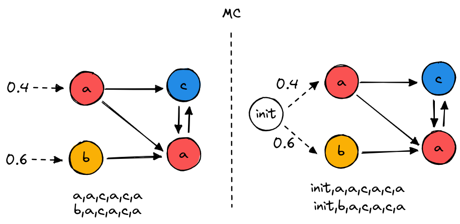
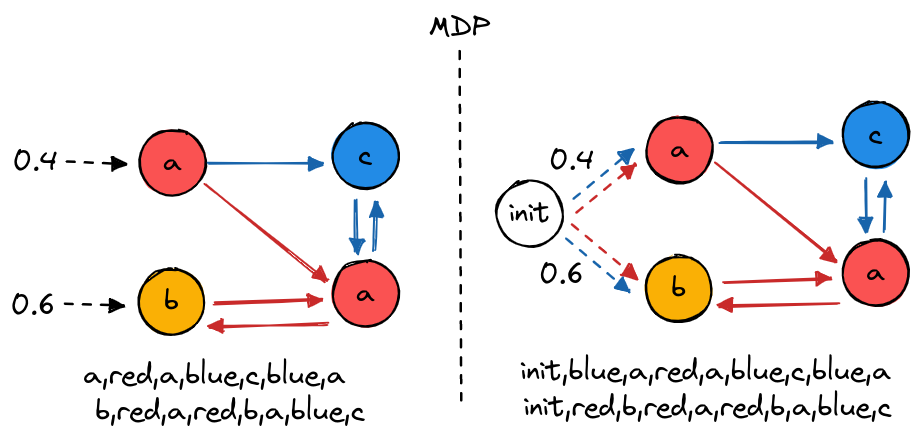

Library description
===================

1. Installation
---------------

To install jajapy just run the following command:

.. code-block:: python

	>>> pip install jajapy

2. Workflow
-----------

.. image:: pictures/workflow.png
	:width: 80%
	:align: center

A complete workflow. In green: algorithms provided by *Jajapy*. In blue: algorithms provided by *Stormpy*.

Model checkers, such as *Storm* or *Prism*, offer different methods to analyse stochastic models.
However, the model under analysis must be provided, while, in many cases, system behaviours are accessible instead of the model itself.

*Jajapy* is a python extension to the *Storm* model checker, which learns stochastic models from system behaviours.
Given a dataset, *Jajapy* automatically generates a Markov model in *Stormpy* format. Additionally, *Jajapy* model can be save to a *Prism* file.

*Jajapy* output models are directly translated to a *Stormpy sparse model* by default (if *Stormpy* is installed on the machine).
You can change this behaviour by changing the value of the parameter `stormpy_output` of the `fit` function.

*Jajapy* basic usage can be described in few steps:

1. Getting the training set,
2. choosing the learning algorithm,
3. executing it (this may take some times),
4. your model is ready, you can use *Stormpy* to model check it!

.. note::
	HMMs and GoHMMs (see below) are not compatible with *Storm* and *Prism*: *Jajapy* can only learn them.

3. Models
---------

*Jajapy* supports different kind of Markov models that have different properties.

The following table summarizes the main properties of these models. The *second column* indicates
if, at each timestep, a model generates a discrete observation, or a vector of continuous observations
(this vector can possibly contains only one value).
The *third column* indicates if the model is deterministic or not.
The *fourth* one shows if the model is a continuous time model (or a discrete time model).
A continuous time model will wait in each state for some period of time (called *dwell time*) before moving to another state.
Finally the last solumn indicates if the model is parametric.
In a parametric model, transition probabilities can be expressed are polynomial composition of parameters.
A parameter can also be involved in several transitions.

======  ==================== ============= =============== ==========
Model   Observations type    Deterministic Continuous time Parametric
======  ==================== ============= =============== ==========
HMM                 Discrete           Yes              No         No
MC                  Discrete           Yes              No         No
MDP                 Discrete            No              No         No
CTMC                Discrete           Yes             Yes         No
PCTMC               Discrete           Yes              No        Yes
GoHMM   Vector of Continuous           Yes              No         No
======  ==================== ============= =============== ==========

One can wander what is the difference between MC and HMM: each MC state is labelled with exactly one
observation, which is seen each time we are in this state. On the other hand, each HMM state is
associated with a probability distribution over the observations. Each time we are in this HMM state,
an observation is generated according to the probability distribution associated to this state.

.. _jajapy-and-stormpy :

4. *Jajapy* and *Stormpy* 
-------------------------

.. note::
	This section concerns MDPs, MCs, CTMCs and PCTMCs only. Other models are not compatible with *Stormpy*.

Due to performance reasons, *Jajapy* uses its representation of the models during the learning process.
Once the learning process is over, *Jajapy* converts the output model to a sparse *Stormpy* model.

The initial hypothesis of the Baum-Welch algorithm can be:

- a random model: then the number of state and alphabet only should be provided to *Jajapy*,
- a *Jajapy* model,
- a *Stormpy sparse* model.

These translation are straightforward and doesn't change the structures of the models.

.. note::
   *Stormpy* models can be translated to *Jajapy* ones only if all states in the *Stormpy* model
   are labelled with at most one observation.

Initial distributions and the *init* label
^^^^^^^^^^^^^^^^^^^^^^^^^^^^^^^^^^^^^^^^^^
*Stormpy* doesn't handle initial distribution: it chooses the intial state according to an uniform
distribution over the states labelled with *init*. On the other hand, *Jajapy* chooses the initial
state according to any discrete distribution over the states defined by the user. 

To make *Jajapy* models compatible with *Stormpy* one, *Jajapy* add one state labelled with *init* at the
creation of the model. The transitions leaving this state simulate the initial distribution given by
the user as on the following pictures:

The same transformation applies for MDPs, except that the transitions are available for any action.

5. *Jajapy* and *Prism* 
-----------------------
.. note::
	This section concerns MDPs, MCs, CTMCs and PCTMCs only. Other models are not compatible with *Prism*.

*Jajapy* can load *Prism dtmc* (called *MC* in *Jajapy*), *ctmc* and *mdp*.
This can be useful if the SUL is described in a Prism file and one needs to generated the training set from it, or if
the initial hypothesis for the Baum-Welch algorithm is described in a Prism file.

*Jajapy* can also save any model into a Prism file. One can use this to save the output model of the learning process.

6. Examples and tutorial
------------------------
The :ref:`tutorial-page` page contains several examples from the most basic to the most complex.
It is the best place to start your journey through *Jajapy*!