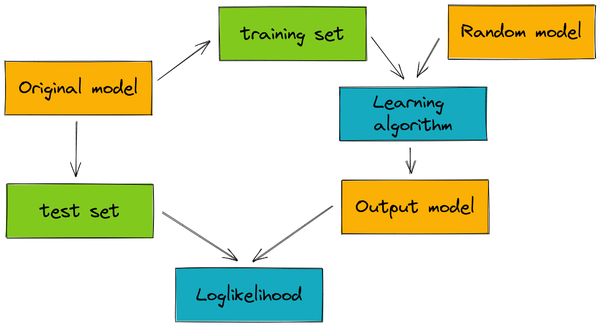

Getting Started
===============

1. Installation
---------------

To install jajapy just run the follwing command:

.. code-block:: python

	>>> pip install jajapy

.. note::
   jajapy requires to have `numpy <https://numpy.org/>`_ and `scipy <https://scipy.org/>`_ installed.

2. Some Terminology
-------------------

With jajapy, we learn the **original model** using an machine learning algorithm (mostly the Baum-Welch algorithm) on 
a **training set**. The learning algorithm gives us an **output model**. To evaluated the quality of it, we compute the
loglikeihood of a **test set** under the **output model**.

3. Models
---------

`jajapy` supports different kind of Markov models that have different properties.

The following table summarizes the main properties of these models. The *first column* indicates
if, at each timestep, a model generates a discrete observation, a continuous observations, or a
vector of continuous observations. The *second column* shows if the observations are generated while
in a state or while moving from one state to another (in the first case the generation function is
independant to the transition function, not in the second case). The *third column* indicates
if the model is deterministic. And finally the *fourth column* shows if the model is a continuous
time model (or a discrete time model). A continuous time model will wait in each state for some period
of time before moving to another state.

======  ==================== ====================== ============= ===============
Model   Observations type    Observation generation Deterministic Continuous time
======  ==================== ====================== ============= ===============
HMM                 Discrete                  State           Yes              No
MC                  Discrete             Transition           Yes              No
MDP                 Discrete             Transition            No              No
CTMC                Discrete             Transition           Yes             Yes
GOHMM             Continuous                  State           Yes              No
MGOHMM  Vector of Continuous                  State           Yes              No
======  ==================== ====================== ============= ===============

.. toctree::
   :maxdepth: 1

   HMM
   MC
   MDP
   CTMC
   GOHMM
   MGOHMM

Technical information
^^^^^^^^^^^^^^^^^^^^^

In *jajapy* we use explicit representation for the models. Hence, each model has a *numpy ndarray* as attribute which
describes all the transitions in the model.

The following tables recaps how the models and the ndarrays are structured:

========== ================ ====================== ============ ================= =================
HMM                   Usage         Type of output Source state Destination State       Observation
========== ================ ====================== ============ ================= =================
HMM.matrix   matrix[s1][s2]    Probability (float)           s1                s2
HMM.output  output[s1][obs]    Probability (float)           s1                s2 HMM.alphabet[obs]
========== ================ ====================== ============ ================= =================

========== ==================== ====================== ============ ================= =================
MC                        Usage         Type of output Source state Destination State       Observation
========== ==================== ====================== ============ ================= =================
MC.matrix   matrix[s1][s2][obs]    Probability (float)           s1                s2  MC.alphabet[obs]
========== ==================== ====================== ============ ================= =================

========== ========================== ====================== ============ ================= ================= ================
MDP                       Usage               Type of output Source state Destination State       Observation           Action
========== ========================== ====================== ============ ================= ================= ================
MDP.matrix   matrix[s1][act][s2][obs]    Probability (float)           s1                s2 MDP.alphabet[obs] MDP.actions[act]
========== ========================== ====================== ============ ================= ================= ================

============ ==================== ============== ============ ================= ==================
CTMC                        Usage Type of output Source state Destination State        Observation
============ ==================== ============== ============ ================= ==================
CTMC.matrix   matrix[s1][s2][obs]   Rate (float)           s1                s2 CTMC.alphabet[obs]
============ ==================== ============== ============ ================= ==================

============ ================ ===================================== ============= =================
GOHMM                   Usage                        Type of output  Source state Destination State
============ ================ ===================================== ============= =================
GOHMM.matrix   matrix[s1][s2]                   Probability (float)            s1                s2
GOHMM.output       output[s1] List of parameters [mu, sigma] (list)            s1                  
============ ================ ===================================== ============= =================

============= ================ ============================================= ============ =================
MGOHMM                   Usage                                Type of output Source state Destination State
============= ================ ============================================= ============ =================
MGOHMM.matrix   matrix[s1][s2]                           Probability (float)           s1                s2
MGOHMM.output       output[s1] List of List of parameters [mu, sigma] (list)           s1                  
============= ================ ============================================= ============ =================

Creating such ndarray is complicated and not very funny, that's why we recommend to use the functions `HMM_state`, `MC_state`, `MDP_state` etc... 
depending on the kind of model you are creating (see the examples :ref:`_create-hmm-example`).

4. Workflow
-----------

.. image:: pictures/workflow.png
	:width: 80%
	:align: center

To learn a model with jajapy, you need to have a training set. And to evaluate it, you need a test set. In a real life application,
these sets are given, but one can imagine a situation you have the original model. Then you first need to generate the sets and then you can 
use them.

Once a model is learnt, we can directly translate it to a *stormpy sparse model* and model check some properties (see the examples :ref:`stormpy-example`).

5. Examples
-----------

You can find examples in the tutorial page.