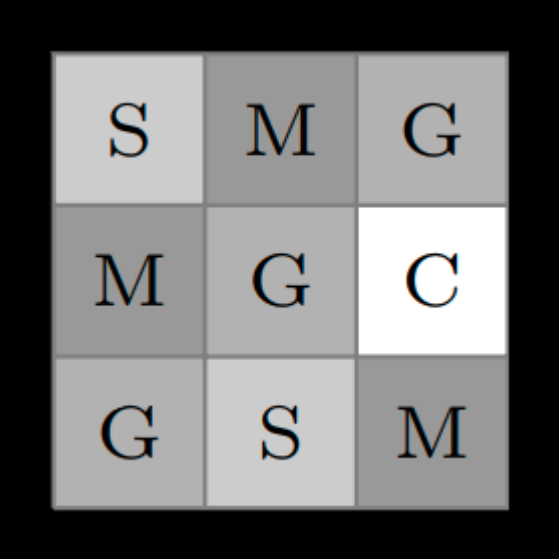
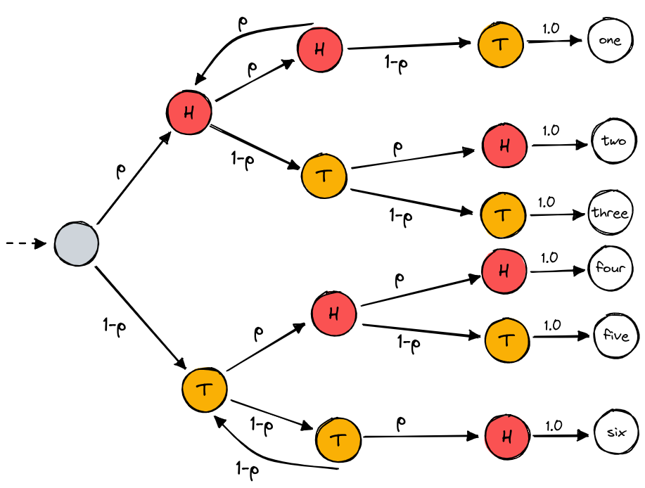
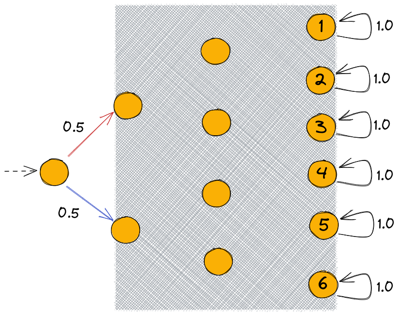

Tutorial
===============

1. A simple example with HMMs
-----------------------------

`python file <https://github.com/Rapfff/jajapy/tree/main/examples/01-hmms.py>`_

In this example, we will:

1. Create a HMM *H* from scratch,
2. Use it to generate a training set,
3. Use the Baum-Welch algorithm to learn, from the training set, *H*,
4. Compare *H* with the model generated at the previous step.

Creating a HMM
^^^^^^^^^^^^^^

.. image:: pictures/HMM.png
	:width: 60%
	:align: center

.. _create-hmm-example:

We can create the model depicted above like this:

.. code-block:: python

	import jajapy as ja
	from numpy import array
	alphabet = ['a','b','x','y']
	nb_states = 5

	# in the next state we generate 'x' with probability 0.4, and 'y' with probability 0.6
	# once an observation generated, we move to state 1 or 2 with probability 0.5
	# the id of this state is 0.
	s0 = ja.HMM_state([("x",0.4),("y",0.6)],[(1,0.5),(2,0.5)],alphabet,nb_states)
	s1 = ja.HMM_state([("a",0.8),("b",0.2)],[(3,1.0)],alphabet,nb_states)
	s2 = ja.HMM_state([("a",0.1),("b",0.9)],[(4,1.0)],alphabet,nb_states)
	s3 = ja.HMM_state([("x",0.5),("y",0.5)],[(0,0.8),(1,0.1),(2,0.1)],alphabet,nb_states)
	s4 = ja.HMM_state([("y",1.0)],[(3,1.0)],alphabet,nb_states)
	transitions = array([s0[0],s1[0],s2[0],s3[0],s4[0]])
	output = array([s0[1],s1[1],s2[1],s3[1],s4[1]])
	original_model = ja.HMM(transitions,output,alphabet,initial_state=0,name="My HMM")
	print(original_model)

*(optional)* This model can be saved into a text file and then loaded as follow:

.. code-block:: python

	original_model.save("my_model.txt")
	original_model = ja.loadHMM("my_model.txt")

Generating a training set
^^^^^^^^^^^^^^^^^^^^^^^^^
Now we can generate a training set. This training set contains 1000 traces, which all consists of 10 observations.

.. code-block:: python

	# We generate 1000 sequences of 10 observations
	training_set = original_model.generateSet(set_size=1000, param=10)

*(optional)* This Set can be saved into a text file and then loaded as follow:

.. code-block:: python

	training_set.save("my_training_set.txt")
	training_set = ja.loadSet("my_training_set.txt")

Learning a HMM using BW
^^^^^^^^^^^^^^^^^^^^^^^
Let now use our training set to learn ``original_model`` with the Baum-Welch algorithm:

.. code-block:: python

	output_model = ja.BW_HMM().fit(training_set, nb_states=5)
	print(output_model)

For the initial model we used a randomly generated HMM with 5 states.

Evaluating the BW output model
^^^^^^^^^^^^^^^^^^^^^^^^^^^^^^
Eventually we compare the output model with the original one. The usual way to do so is to generate a test set and compare
the loglikelihood of it under each of the two models. As the training set, our test set will contain 1000 traces of length 10.

.. code-block:: python

	# We generate 1000 sequences of 10 observations
	test_set = original_model.generateSet(set_size=1000, param=10)

Now we can compute the loglikelihood under each model:

.. code-block:: python

	ll_original = original_model.logLikelihood(test_set)
	ll_output   =   output_model.logLikelihood(test_set)
	quality = ll_original - ll_output
	print(quality)

If ``quality`` is positive then we are overfitting.

2. An example with MC: random restart
-------------------------------------

`python file <https://github.com/Rapfff/jajapy/tree/main/examples/02-mcs.py>`_

This time we will try to learn the `Reber grammar <https://cnl.salk.edu/~schraudo/teach/NNcourse/reber.html>`_.
We have added probabilities on the transitions in order to have a MC.

.. image:: pictures/REBER.png
	:width: 80%
	:align: center

As before we will first create the original model and generate the training set, then we will learn it several times
with different random initial hypothesis. We will keep only the best model, i.e. the one maximizing the loglikeihood
of the test set. This technique is called *random restart*.

Creating the MC and generating the training set
^^^^^^^^^^^^^^^^^^^^^^^^^^^^^^^^^^^^^^^^^^^^^^^
This step is similar to what we did before.

.. code-block:: python

	>>> import jajapy as ja
	>>> from numpy import array
	>>> def modelMC_REBER():
	...		alphabet = list("BTPSXVE")
	...		initial_state = 0
	...		nb_states = 7
	...		s0 = ja.MC_state([(1,'B',1.0)],alphabet,nb_states)
	...		s1 = ja.MC_state([(2,'T',0.5),(3,'P',0.5)],alphabet,nb_states)
	...		s2 = ja.MC_state([(2,'S',0.6),(4,'X',0.4)],alphabet,nb_states)
	...		s3 = ja.MC_state([(3,'T',0.7),(5,'V',0.3)],alphabet,nb_states)
	...		s4 = ja.MC_state([(3,'X',0.5),(6,'S',0.5)],alphabet,nb_states)
	...		s5 = ja.MC_state([(4,'P',0.5),(6,'V',0.5)],alphabet,nb_states)
	...		s6 = ja.MC_state([(6,'E',1.0)],alphabet,nb_states)
	...		matrix = array([s0,s1,s2,s3,s4,s5,s6])
	...		return ja.MC(matrix,alphabet,initial_state,"MC_REBER")

	>>> original_model = modelMC_REBER()
	>>> training_set = original_model.generateSet(100,10)
	>>> test_set = original_model.generateSet(100,10)

Learning a MC using random restart
^^^^^^^^^^^^^^^^^^^^^^^^^^^^^^^^^^
We will learn the model 10 times

.. code-block:: python

	>>> nb_trials = 10

At each iteration, the library will generate a new model with 7 states.

.. code-block:: python

	>>> best_model = None
	>>> quality_best = -1024
	>>> for n in range(1,nb_trials+1):
	...		current_model = ja.BW_MC().fit(training_set,nb_states=7,pp=n)
	...		current_quality = current_model.logLikelihood(test_set)
	...		if quality_best < current_quality: #we keep the best model only
	...			quality_best = current_quality
	...			best_model = current_model

	1 2022-06-10 15:30:40.182680 18 -4.9172406492680425
	2 2022-06-10 15:30:42.374435 39 -6.4018575770548175
	3 2022-06-10 15:30:43.294718 16 -3.7554041624120225
	4 2022-06-10 15:30:45.055337 32 -6.386989354949701
	5 2022-06-10 15:30:46.182094 20 -4.9172608945837965
	6 2022-06-10 15:30:47.737216 28 -4.8655273045172875
	7 2022-06-10 15:30:48.954496 21 -4.8655375569300075
	8 2022-06-10 15:30:49.838456 15 -3.7553820970441403
	9 2022-06-10 15:30:51.707971 34 -6.5912424914366295
	10 2022-06-10 15:30:53.624749 35 -4.8603055582095825

Notice that the current trial number appears at the beginnig of each print: this is because we 
have set the ``pp`` parameter of the ``fit`` method with the current trial number.

.. code-block:: python

	>>> print(quality_best)
	-4.203193155960113

The loglikelihood of the test set under the best model is good. Let's have a look to the model:

.. code-block:: python

	>>> print(best_model)
	Name: unknown_MC
	Initial state: s0
	----STATE s0----
	s0 - (B) -> s2 : 1.0

	----STATE s1----
	s1 - (P) -> s3 : 0.442856225551485
	s1 - (V) -> s4 : 0.557142857159759

	----STATE s2----
	s2 - (T) -> s5 : 0.47000000065663733
	s2 - (P) -> s6 : 0.5299999993433626

	----STATE s3----
	s3 - (S) -> s4 : 0.5945946507179358
	s3 - (X) -> s6 : 0.40540533276914115

	----STATE s4----
	s4 - (E) -> s4 : 0.9999990255327565

	----STATE s5----
	s5 - (X) -> s3 : 0.46078434394781576
	s5 - (S) -> s5 : 0.5392156560521841

	----STATE s6----
	s6 - (V) -> s1 : 0.34579439270651224
	s6 - (T) -> s6 : 0.6542056072395087

One can be suprised to see that the probability to leave *s4* is not equal to zero.
This is because *jajapy* doesn't print out the transitions with a very low probability,
for a better readability.  

3. An example with MDP: active learning
---------------------------------------
`python file <https://github.com/Rapfff/jajapy/tree/main/examples/03-mds.py>`_

Here, we will learn a MDP representing the following grid world:

We start in the top-left cell and our destination is the bottom-right one.
We can move in any of the four directions *North, South, East and West*.
We may make errors in movement, e.g. move south west instead of south with
an error probability depending on the target terrain. This model is the one
in `this paper <https://arxiv.org/pdf/2110.03014.pdf>`_.

First we create the original model.

.. code-block:: python

	import jajapy as ja
	from numpy import array

	def modelMDP_gridworld():
		alphabet = ['S','M','G','C','W',"done"]
		actions = list("nsew")
		nb_states = 12
		s0 = ja.MDP_state({'n': [(0,'W',1.0)],
						's': [(3,'M',0.6),(4,'G',0.4)],
						'e': [(1,'M',0.6),(4,'G',0.4)],
						'w': [(0,'W',1.0)]
						},alphabet,nb_states,actions)
		s1 = ja.MDP_state({'n': [(1,'W',1.0)],
						's': [(4,'G',0.8),(3,'M',0.1),(5,'C',0.1)],
						'e': [(2,'G',0.8),(5,'C',0.2)],
						'w': [(0,'S',0.75),(3,'M',0.25)]
						},alphabet,nb_states,actions)
		s2 = ja.MDP_state({'n': [(2,'W',1.0)],
						's': [(4,'G',0.8),(3,'M',0.1),(5,'C',0.1)],
						'e': [(2,'W',1.0)],
						'w': [(1,'M',0.6),(4,'G',0.4)]
						},alphabet,nb_states,actions)
		s3 = ja.MDP_state({'n': [(0,'S',0.75),(1,'M',0.25)],
						's': [(6,'G',0.8),(7,'S',0.2)],
						'e': [(4,'G',0.8),(1,'M',0.1),(7,'S',0.1)],
						'w': [(3,'M',1.0)]
						},alphabet,nb_states,actions)
		s4 = ja.MDP_state({'n': [(1,'M',0.6),(0,'S',0.2),(2,'G',0.2)],
						's': [(7,'S',0.75),(6,'G',0.125),(8,'done',0.125)],
						'e': [(5,'C',1.0)],
						'w': [(3,'M',0.6),(0,'S',0.2),(6,'G',0.2)]
						},alphabet,nb_states,actions)
		s5 = ja.MDP_state({'n': [(2,'G',0.8),(1,'M',0.2)],
						's': [(8,'done',0.6),(7,'S',0.4)],
						'e': [(5,'W',1.0)],
						'w': [(4,'G',0.8),(1,'M',0.1),(7,'S',0.1)]
						},alphabet,nb_states,actions)
		s6 = ja.MDP_state({'n': [(3,'M',0.6),(4,'G',0.4)],
						's': [(6,'W',1.0)],
						'e': [(7,'S',0.75),(4,'G',0.25)],
						'w': [(6,'W',1.0)]
						},alphabet,nb_states,actions)
		s7 = ja.MDP_state({'n': [(1,'M',0.6),(0,'S',0.2),(2,'G',0.2)],
						's': [(7,'W',1.0)],
						'e': [(8,'done',0.6),(5,'C',0.4)],
						'w': [(6,'G',0.8),(3,'M',0.2)]
						},alphabet,nb_states,actions)
		s8 = ja.MDP_state({'n': [(8,'done',1.0)],
						's': [(8,'done',1.0)],
						'e': [(8,'done',1.0)],
						'w': [(8,'done',1.0)]
						},alphabet,nb_states,actions)
		matrix = array([s0,s1,s2,s3,s4,s5,s6,s7,s8])
		return ja.MDP(matrix,alphabet,actions,initial_state=0,name="grid world")

Then we generate our training set and test set. To generate a set we need to specify to
jajapy which scheduler we want it to use, since MDPs are non-deterministic. Here we will
use uniform scheduler (all the actions have the same probability to be chosen).

.. code-block:: python

	original_model = modelMDP_gridworld()
	# SETS GENERATION
	#------------------------
	# We generate 1000 sequences of 10 observations for each set
	scheduler = ja.UniformScheduler(original_model.getActions())
	training_set = original_model.generateSet(1000,10,scheduler)
	test_set = original_model.generateSet(1000,10,scheduler)

Then we can learn the model. Here we do 20 active learning iterations:
for each of them we generate 50 new sequences. These sequences will be generated
using the *active learning scheduler* with probability 0.75, and with a uniform
scheduler with probability 0.25. 

.. code-block:: python

	# LEARNING
	#---------
	learning_rate = 0
	output_model = ja.Active_BW_MDP().fit(training_set,learning_rate,
										  nb_iterations=20, nb_sequences=50,
										  epsilon_greedy=0.75, nb_states=9)
	output_quality = output_model.logLikelihood(test_set)
	
	print(output_model)
	print(output_quality)

.. _stormpy-example:

4. An advanced example with MC and model checking
-------------------------------------------------

`python file <https://github.com/Rapfff/jajapy/tree/main/examples/04-mcs_with_stormpy.py>`_

In this example, we will first learn a MC representation of the Yao-Knuth'die 
(see above) using some structural knowledge we have. Then, we will use *stormpy* to check
if our model satisfies some properties.

As usual, we start by creating the training and test set.

.. code-block:: python

	import jajapy as ja
	from numpy import array

	def modelMC_KnuthDie(p=0.5):
		alphabet = ["P","F","one","two","three","four","five","six"]
		nb_states = 13
		s0 = ja.MC_state([(1 ,'P',p),(2 ,'F',1-p)],alphabet,nb_states)
		s1 = ja.MC_state([(3 ,'P',p),(4 ,'F',1-p)],alphabet,nb_states)
		s2 = ja.MC_state([(5 ,'P',p),(6 ,'F',1-p)],alphabet,nb_states)
		s3 = ja.MC_state([(1 ,'P',p),(7 ,'F',1-p)],alphabet,nb_states)
		s4 = ja.MC_state([(8 ,'P',p),(9 ,'F',1-p)],alphabet,nb_states)
		s5 = ja.MC_state([(10,'P',p),(11,'F',1-p)],alphabet,nb_states)
		s6 = ja.MC_state([(12,'P',p),(2 ,'F',1-p)],alphabet,nb_states)
		s7 = ja.MC_state([(7 ,  'one',1.0)],alphabet,nb_states)
		s8 = ja.MC_state([(8 ,  'two',1.0)],alphabet,nb_states)
		s9 = ja.MC_state([(9 ,'three',1.0)],alphabet,nb_states)
		s10= ja.MC_state([(10, 'four',1.0)],alphabet,nb_states)
		s11= ja.MC_state([(11, 'five',1.0)],alphabet,nb_states)
		s12= ja.MC_state([(12,  'six',1.0)],alphabet,nb_states)
		matrix = array([s0,s1,s2,s3,s4,s5,s6,s7,s8,s9,s10,s11,s12])
		return ja.MC(matrix,alphabet,initial_state=0,name="Knuth's Die")
	
	original_model = modelMC_KnuthDie()
	# SETS GENERATION
	#------------------------
	# We generate 1000 sequences of 10 observations for each set
	training_set = original_model.generateSet(1000,10)
	test_set = original_model.generateSet(1000,10)

Now, we can learn the model using Baum-Welch. But here, we assume that we have some knowledge about
the structure of what we are learning. In fact, Baum-Welch improve the initial model iteratively by
removing some transitions and changing some transitions probabilities, but it cannot create a new
transition: if there is no transition between *s0* and *s1* in the initial hypothesis, there will be
no transition there as well in the output model. Let say that here we know that what we are learning
looks like this (we don't have any information about the transitions in the shaded area):

We can now create our initial hypothesis and learn the model. Once again, we will use random restart
to keep only the best model we get.

.. code-block:: python

	def firstGuess():
		alphabet = ["P","F","one","two","three","four","five","six"]
		nb_states = 13
		s0 = ja.MC_state(list(zip([1,2],['P','F'],ja.randomProbabilities(2))),alphabet,nb_states)
		s1 = ja.MC_state(list(zip([1,1,2,2,3,3,4,4,5,5,6,6],
								['P','F','P','F','P','F','P','F','P','F','P','F'],
								ja.randomProbabilities(12))),
						alphabet,nb_states)
		s2 = ja.MC_state(list(zip([1,1,2,2,3,3,4,4,5,5,6,6],
								['P','F','P','F','P','F','P','F','P','F','P','F'],
								ja.randomProbabilities(12))),
						alphabet,nb_states)
		s3 = ja.MC_state(list(zip([1,1,2,2,3,3,4,4,5,5,6,6,7,7,8,8,9,9,10,10,11,11,12,12],
								['P','F','P','F','P','F','P','F','P','F','P','F','P','F','P','F',
								'P','F','P','F','P','F','P','F','P','F','P','F','P','F','P','F',],
								ja.randomProbabilities(24))),
						alphabet,nb_states)

		s4 = ja.MC_state(list(zip([1,1,2,2,3,3,4,4,5,5,6,6,7,7,8,8,9,9,10,10,11,11,12,12],
								['P','F','P','F','P','F','P','F','P','F','P','F','P','F','P','F',
								'P','F','P','F','P','F','P','F','P','F','P','F','P','F','P','F',],
								ja.randomProbabilities(24))),
						alphabet,nb_states)

		s5 = ja.MC_state(list(zip([1,1,2,2,3,3,4,4,5,5,6,6,7,7,8,8,9,9,10,10,11,11,12,12],
								['P','F','P','F','P','F','P','F','P','F','P','F','P','F','P','F',
								'P','F','P','F','P','F','P','F','P','F','P','F','P','F','P','F',],
								ja.randomProbabilities(24))),
						alphabet,nb_states)

		s6 = ja.MC_state(list(zip([1,1,2,2,3,3,4,4,5,5,6,6,7,7,8,8,9,9,10,10,11,11,12,12],
								['P','F','P','F','P','F','P','F','P','F','P','F','P','F','P','F',
								'P','F','P','F','P','F','P','F','P','F','P','F','P','F','P','F',],
								ja.randomProbabilities(24))),
						alphabet,nb_states)
		s7 = ja.MC_state([(7 ,  'one',1.0)],alphabet,nb_states)
		s8 = ja.MC_state([(8 ,  'two',1.0)],alphabet,nb_states)
		s9 = ja.MC_state([(9 ,'three',1.0)],alphabet,nb_states)
		s10= ja.MC_state([(10, 'four',1.0)],alphabet,nb_states)
		s11= ja.MC_state([(11, 'five',1.0)],alphabet,nb_states)
		s12= ja.MC_state([(12,  'six',1.0)],alphabet,nb_states)
		matrix = array([s0,s1,s2,s3,s4,s5,s6,s7,s8,s9,s10,s11,s12])
		return ja.MC(matrix,alphabet,initial_state=0,name="first guess")
	
	# LEARNING
	#---------
	nb_trials = 10 # we will repeat learn this model 10 times
	best_model = None
	quality_best = -1024
	for n in range(1,nb_trials+1):
		current_model = ja.BW_MC().fit(training_set,initial_model=firstGuess())
		current_quality = current_model.logLikelihood(test_set)
		if quality_best < current_quality: #we keep the best model only
				quality_best = current_quality
				best_model = current_model

	print(quality_best)
	print(best_model)

Now, we would like to check if we have a probability of 1/6 to get a *"five"* with 
this new model.

.. code-block:: python

	# MODEL CHECKING
	#---------------
	model_storm = ja.modeltoStorm(best_model)
	formula_str = 'P=? [F "five"]'
	properties = stormpy.parse_properties(formula_str)
	result = stormpy.check_model_sparse(model_storm,properties[0])
	print(result.at(model_storm.initial_states[0]))

