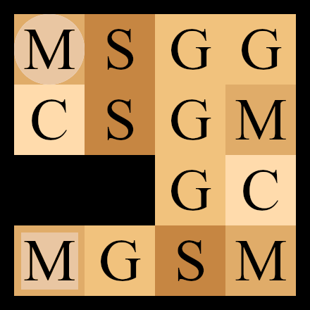

.. _tutorial-page:

Tutorial
========
This page contains many examples illustrating most of *Jajapy* features.

.. figure:: pictures/example_helloworld.png
   :figwidth: 45 %
   :alt: Simple Example
   :align: left

   :ref:`example-helloworld`

.. figure:: pictures/REBER_state.png
   :figwidth: 45 %
   :alt: More advanced example
   :align: right

   :ref:`example-random_restart`

   :ref:`example-mdp`

.. figure:: pictures/grid_3x3.png
   :figwidth: 45 %
   :alt: More advanced example
   :align: right

   :ref:`example-active-bw`

.. figure:: pictures/CTMC.png
   :figwidth: 45 %
   :alt: More advanced example
   :align: left

   :ref:`example-ctmc`

.. figure:: pictures/Tandem.png
   :figwidth: 45 %
   :alt: More advanced example
   :align: right

   :ref:`example-pctmc`

.. figure:: pictures/REBER_state.png
   :figwidth: 45 %
   :alt: More advanced example
   :align: left

   Learning GoHMMs from a csv files

.. figure:: pictures/REBER_state.png
   :figwidth: 45 %
   :alt: More advanced example
   :align: right

   :ref:`example-hmm`
   
.. figure:: pictures/REBER_state.png
   :figwidth: 45 %
   :alt: More advanced example
   :align: left

   Alergia vs Baum-Welch (MC)

.. figure:: pictures/REBER_state.png
   :figwidth: 45 %
   :alt: More advanced example
   :align: right

   IOAlergia vs Baum-Welch (MDP)

